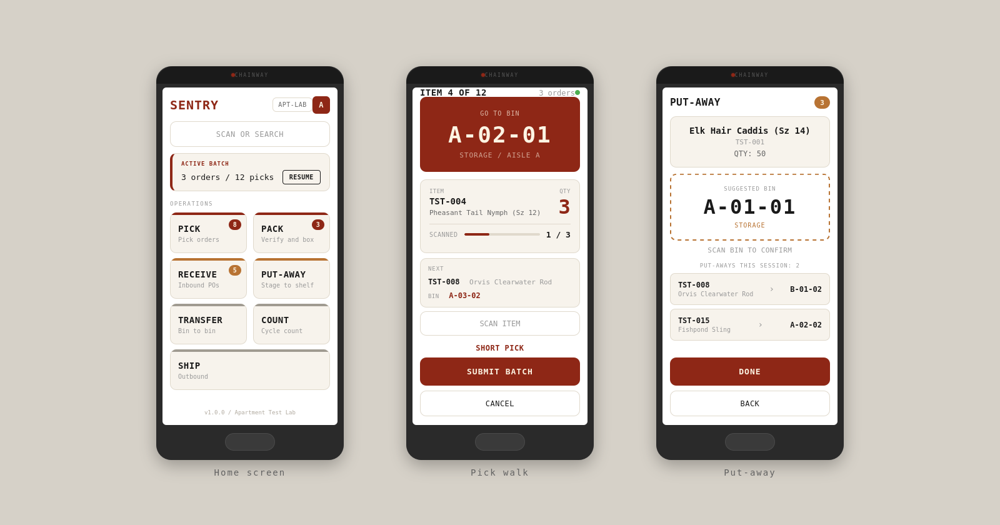

<div align="center">
  
  
  <p><em>Open-source warehouse management system built for barcode scanners</em></p>

  
  
  
  
  **[Documentation](https://hightower-systems.github.io/sentry-wms)** | **[API Reference](https://hightower-systems.github.io/sentry-wms/api-reference/)** | **[Releases](https://github.com/hightower-systems/sentry-wms/releases)**

  
</div>

---

# Sentry WMS

**Open-source warehouse management system built for e-commerce.**

Sentry is the link between the warehouse floor and your system of record. It connects barcode scans, pick tasks, and inventory movements to whatever database or ERP your business runs on.

## What Sentry Does

- **Receiving** - Scan PO barcodes, verify items, stage for put-away
- **Put-Away** - Suggested bin placement, scan-to-confirm storage
- **Picking** - Multi-order batch picking with optimized walk paths
- **Packing** - Scan-to-verify pack station (separate screen from shipping)
- **Shipping** - Carrier/tracking entry, fulfillment recording (separate screen from packing)
- **Cycle Counting** - Bin-level counts with variance detection
- **Bin Transfers** - Move inventory between locations
- **Inter-Warehouse Transfers** - Cross-warehouse inventory moves with audit trail
- **Inventory Adjustments** - Direct add/remove with reason tracking
- **Connector Framework** - Pluggable ERP / commerce sync (orders, items, inventory, fulfillment) with encrypted credential vault, health dashboard, and circuit-breaker-protected outbound calls

## What Sentry Is Not

Sentry is not an ERP. It does not manage orders, products, or customers. It connects to your existing systems (NetSuite, QuickBooks, SAP, or any ERP with an API) and handles the physical warehouse execution layer.

## Architecture

| Layer | Technology |
|-------|-----------|
| Mobile App | React Native (Expo)  -  shared hooks (`useScreenError`), reusable components (`ScreenHeader`, `ModeSelector`, `ScanInput`) |
| API | Python / Flask  -  `@with_db` middleware, `inventory_service` + `picking_service` service layer, `constants.py` status enums |
| Database | PostgreSQL 16 (dev Docker) · PostgreSQL Cloud (prod) |
| Admin Panel | React Web App  -  dark theme, warehouse context picker, `WarehouseContext` provider |

## Quick Start

```bash
# Clone the repo
git clone https://github.com/hightower-systems/sentry-wms.git
cd sentry-wms

# Copy environment config and generate required secrets
cp .env.example .env
# Then edit .env and set each of:
#   JWT_SECRET            -- openssl rand -hex 32
#   SENTRY_ENCRYPTION_KEY -- python -c "from cryptography.fernet import Fernet; print(Fernet.generate_key().decode())"
#   REDIS_PASSWORD        -- python -c "import secrets; print(secrets.token_hex(32))"
# Startup hard-fails if any of these are missing.

# Start PostgreSQL + API + Admin Panel + Redis + Celery worker
docker compose up -d

# Or start with a clean system (no demo data):
# SKIP_SEED=true docker compose up -d

# API is now running at http://localhost:5000
# Admin panel is now running at http://localhost:8080
# Health check: http://localhost:5000/api/health
# Admin login is admin/admin on fresh installs (forced password change on first login)

# For local development with Vite dev-server and hot reload:
# docker compose -f docker-compose.yml -f docker-compose.dev.yml up

# Start the mobile app (separate terminal)
cd mobile
cp .env.example .env    # Set EXPO_PUBLIC_API_URL to your machine's IP
npm install
npx expo start
```

## Admin Panel

The admin panel is a React web app for warehouse managers to monitor operations and configure the system.

- **Dashboard** - pipeline overview, open orders, low stock alerts, recent activity
- **Inventory** - full inventory view with search and pagination
- **Cycle Counts** - create and track bin-level counts
- **Receiving / Put-Away / Picking / Packing / Shipping** - workflow status views
- **Bins / Zones / Items** - warehouse setup with create, edit, and detail views
- **Adjustments** - direct inventory add/remove with reason tracking
- **Inter-Warehouse Transfers** - move inventory between warehouses
- **Users** - user management with role assignment
- **Audit Log** - filterable log viewer with entity name resolution
- **Import** - CSV/JSON bulk import for items, bins, POs, SOs with templates
- **Settings** - warehouse config, manual PO/SO entry, fulfillment workflow toggles, connector setup (credential form + sync health dashboard)
- **Warehouse Picker** - header dropdown to switch warehouse context (all pages filter dynamically)

Built with React 19, Vite, React Router, and plain CSS. Dark theme with copper accents. No component libraries.

## API Endpoints

### Authentication
| Method | Endpoint | Description |
|--------|----------|-------------|
| POST | `/api/auth/login` | Device login, returns JWT token |
| POST | `/api/auth/refresh` | Refresh an existing token |
| POST | `/api/auth/change-password` | Self-service password change (authenticated) |

### Lookups
| Method | Endpoint | Description |
|--------|----------|-------------|
| GET | `/api/lookup/item/<barcode>` | Scan item → details + bin locations |
| GET | `/api/lookup/bin/<barcode>` | Scan bin → contents with quantities |
| GET | `/api/lookup/item/search?q=` | Text search items by SKU, name, UPC |
| GET | `/api/lookup/bin/search?q=` | Text search bins by code |

### Receiving
| Method | Endpoint | Description |
|--------|----------|-------------|
| GET | `/api/receiving/po/<barcode>` | Scan PO → lines with expected items |
| POST | `/api/receiving/receive` | Submit received items to staging bin |
| POST | `/api/receiving/cancel` | Undo receipts by receipt_ids (reverses inventory + PO lines) |

### Put-Away
| Method | Endpoint | Description |
|--------|----------|-------------|
| GET | `/api/putaway/pending/<warehouse_id>` | Items in staging awaiting put-away |
| GET | `/api/putaway/suggest/<item_id>` | Suggested bin for put-away |
| POST | `/api/putaway/confirm` | Confirm put-away to destination bin |

### Picking
| Method | Endpoint | Description |
|--------|----------|-------------|
| POST | `/api/picking/wave-validate` | Validate SO barcode for wave picking |
| POST | `/api/picking/wave-create` | Create wave batch with combined picks across SOs |
| POST | `/api/picking/create-batch` | Create pick batch with optimized walk path |
| GET | `/api/picking/batch/<batch_id>` | Full batch with tasks in walk-path order |
| GET | `/api/picking/batch/<batch_id>/next` | Next pending pick task (includes zone/aisle, nullable) |
| POST | `/api/picking/confirm` | Confirm a pick with barcode validation |
| POST | `/api/picking/short` | Report a short pick |
| POST | `/api/picking/complete-batch` | Mark batch complete |

### Packing
| Method | Endpoint | Description |
|--------|----------|-------------|
| GET | `/api/packing/order/<barcode>` | Scan SO → picked items to verify with weight |
| POST | `/api/packing/verify` | Scan item barcode to verify during packing |
| POST | `/api/packing/complete` | Mark order fully packed |

### Shipping
| Method | Endpoint | Description |
|--------|----------|-------------|
| POST | `/api/shipping/fulfill` | Submit shipment with tracking + carrier info |

### Cycle Counting
| Method | Endpoint | Description |
|--------|----------|-------------|
| POST | `/api/inventory/cycle-count/create` | Create cycle counts for bins with inventory snapshot |
| GET | `/api/inventory/cycle-count/<count_id>` | View count with expected vs counted quantities |
| POST | `/api/inventory/cycle-count/submit` | Submit counts, auto-adjust variances |

### Bin Transfers
| Method | Endpoint | Description |
|--------|----------|-------------|
| POST | `/api/transfers/move` | Move items between bins |

### Inventory Adjustments & Inter-Warehouse Transfers
| Method | Endpoint | Description |
|--------|----------|-------------|
| POST | `/api/admin/adjustments/direct` | Create and auto-approve inventory adjustment |
| GET | `/api/admin/adjustments/list` | List adjustments with item/bin details |
| POST | `/api/admin/inter-warehouse-transfer` | Move inventory between warehouses |
| GET | `/api/admin/inter-warehouse-transfers` | Recent inter-warehouse transfer history |

### Admin CRUD
| Method | Endpoint | Description |
|--------|----------|-------------|
| GET | `/api/admin/warehouses` | List warehouses |
| GET | `/api/admin/warehouses/<id>` | Get warehouse with zones |
| POST | `/api/admin/warehouses` | Create warehouse |
| PUT | `/api/admin/warehouses/<id>` | Update warehouse |
| GET | `/api/admin/zones` | List zones (filter by warehouse) |
| POST | `/api/admin/zones` | Create zone |
| PUT | `/api/admin/zones/<id>` | Update zone |
| GET | `/api/admin/bins` | List bins (filter by warehouse/zone) |
| GET | `/api/admin/bins/<id>` | Get bin with inventory |
| POST | `/api/admin/bins` | Create bin |
| PUT | `/api/admin/bins/<id>` | Update bin |
| GET | `/api/admin/items` | List items (paginated, filter by category/active) |
| GET | `/api/admin/items/<id>` | Get item with inventory locations |
| POST | `/api/admin/items` | Create item |
| PUT | `/api/admin/items/<id>` | Update item |
| DELETE | `/api/admin/items/<id>` | Deactivate item (soft delete) |
| GET | `/api/admin/purchase-orders` | List POs (paginated, filter by status) |
| GET | `/api/admin/purchase-orders/<id>` | Get PO with lines |
| POST | `/api/admin/purchase-orders` | Create PO with lines |
| PUT | `/api/admin/purchase-orders/<id>` | Update PO (OPEN only) |
| POST | `/api/admin/purchase-orders/<id>/close` | Close PO |
| GET | `/api/admin/sales-orders` | List SOs (paginated, filter by status) |
| GET | `/api/admin/sales-orders/<id>` | Get SO with lines |
| POST | `/api/admin/sales-orders` | Create SO with lines |
| PUT | `/api/admin/sales-orders/<id>` | Update SO (OPEN only) |
| POST | `/api/admin/sales-orders/<id>/cancel` | Cancel SO (releases inventory) |
| GET | `/api/admin/users` | List users |
| POST | `/api/admin/users` | Create user |
| PUT | `/api/admin/users/<id>` | Update user |
| DELETE | `/api/admin/users/<id>` | Delete user (hard delete) |
| GET | `/api/admin/audit-log` | Audit log (paginated, filterable) |
| GET | `/api/admin/inventory` | Inventory overview (paginated) |
| POST | `/api/admin/import/<type>` | Bulk import items or bins |
| GET | `/api/admin/dashboard` | Dashboard stats and counts |
| GET | `/api/admin/short-picks` | Short pick report (filter by days, warehouse) |

## Database

### Bin Types

Sentry uses 3 bin types that control whether the pick algorithm can pull inventory:

| Type | Pickable? | Purpose |
|------|-----------|---------|
| `Staging` | No | Inbound dock, QC hold. Inventory lands here on receipt. Put-away moves it out. |
| `PickableStaging` | Yes | Staging area where admin allows pickers to pull fresh inventory before formal put-away. |
| `Pickable` | Yes | Standard shelf bins, bulk storage, shipping desk. Default for most bins. |

### Test Lab Seed Data

The apartment lab seed (`db/seed-apartment-lab.sql`) matches 61 printed Zebra barcode labels:

- 2 warehouses, 6 zones, 16 bins
- 20 items (fly fishing catalog, TST-001 through TST-020)
- 5 purchase orders (10/3/8/5/1 lines)
- 20 sales orders (single-item, multi-item, contention, serpentine walk, short pick test)

Set `SKIP_SEED=true` to start with a clean system (admin user + one empty warehouse only, no demo data).

### Security

See [SECURITY.md](SECURITY.md) for the full policy, [SECURITY_BACKLOG.md](SECURITY_BACKLOG.md) for the
deferred-findings roadmap, and the `v1.3.0` entry in [CHANGELOG.md](CHANGELOG.md) for the
per-finding list closed in this release. Highlights:

- All secrets (`JWT_SECRET`, `SENTRY_ENCRYPTION_KEY`, `REDIS_PASSWORD`) required at startup;
  containers hard-fail on missing values
- Encrypted credential vault (Fernet) for connector secrets; values are never returned in API
  responses or logs
- Audit log is append-only with a SHA-256 chain hash; `verify_audit_log_chain()` detects any
  retroactive edit
- Row-level locks on inventory mutations (receive, pick, allocate, move) prevent over-receipt
  and oversell under concurrency
- Tenant isolation is enforced in SQL: non-admin lookups return the same 404 for
  wrong-warehouse as they do for missing records (no existence oracle)
- Connector outbound HTTP guarded by an SSRF allowlist (blocks private/loopback/link-local
  IPs and internal docker hostnames)
- Login lockout is IP-scoped so a remote attacker cannot DoS a known username
- Admin panel is a production nginx multi-stage build (Vite dev-server only available in the
  `docker-compose.dev.yml` overlay); runs as `USER nginx`
- Redis broker requires `--requirepass`; Celery uses the authenticated URL
- CSV import runs through pydantic with formula-injection guards on text fields
- All SQL uses parameterized bindings; response headers set nosniff / DENY / strict-origin
  Referrer-Policy / restrictive Permissions-Policy

### Testing

647 backend tests using transaction-rollback isolation (savepoint per test, rollback after).
Runs in ~18 seconds. 24 are infrastructure-config tests that correctly skip when the suite
runs inside the api container.

```bash
docker compose exec api python -m pytest tests/ -v --tb=short
```

## Project Status

**v1.37.0 - Sales orders open in place. The Backorders, Dashboard, RMA and Refunds pages could show a sales order but not open it, so reaching one meant navigating to Sales Orders, searching for the number you had just been looking at, and losing your place in the list. The SO edit modal moves into its own component and those four pages mount it directly, so a row opens where you are and closing it returns you to the same list at the same scroll position; the page itself drops from about 2,300 lines to 150. The modal gains a related-records tab that walks an order's family in both directions, returning ancestors, descendants and siblings with their relationship to the order in view, depth-capped so a corrupt parent chain terminates rather than spinning the recursive walk. Underneath both, admin tables stop keying rows by array position: no admin list payload carries a bare `id`, so every table fell through to the index and React reconciled by position, handing a cell holding state a different record's props when a row above it was removed. Fraud Review's memo box was where that surfaced, a CSR's typed note staying on screen while the order under it changed. Tables now name what identifies a row, and a test asserts every call site does. No migrations; no mobile changes (build stays 1.36.0 / versionCode 13).**

| Version | Milestone | Status |
|---------|-----------|--------|
| v0.1.0 | Foundation - project structure, schema, Docker | ✅ Complete |
| v0.2.0 | JWT auth, item/bin lookups | ✅ Complete |
| v0.3.0 | Receiving + put-away | ✅ Complete |
| v0.4.0 | Batch picking with path optimization | ✅ Complete |
| v0.5.0 | Pack + ship (separate screens) | ✅ Complete |
| v0.6.0 | Inventory management (cycle counts, transfers) | ✅ Complete |
| v0.7.0 | Admin CRUD API | ✅ Complete |
| v0.8.0 | React admin panel | ✅ Complete |
| v0.8.1 | Wave picking with combined SO batches | ✅ Complete |
| v0.9.0 | Mobile scanner app (12 screens, C6000 support) | ✅ Complete |
| v0.9.1 | Apartment lab testing, preferred bins, bug fixes | ✅ Complete |
| v0.9.2 | Test infrastructure, bin type simplification, short pick reporting | ✅ Complete |
| v0.9.3 | UI revamp - tan cards, accent stripes, carrier picker, blind counts | ✅ Complete |
| v0.9.4 | Structural refactor - service layer, admin split, shared styles/hooks | ✅ Complete |
| v0.9.5 | Scan hardening, cycle count approval, admin UX overhaul, CSV templates | ✅ Complete |
| v0.9.6 | Scan hardening, put-away reorder, manual picking, role simplification | ✅ Complete |
| v0.9.7 | 27-bug hardware test fix (repeat offenders, styled modals, EAS build) | ✅ Complete |
| v0.9.8 | Admin dark theme, warehouse picker, security hardening, status constants, SKIP_SEED | ✅ Complete |
| v0.9.9 | SQL parameterization, warehouse auth, JWT hardening, FK indexes, scanner plugin fix | ✅ Complete |
| **v1.0.0** | **Production release - full security audit, penetration test fixes, hardened infrastructure** | ✅ **Released** |
| **v1.1.0** | **Security hardening - JWT claims, token invalidation, rate limiting, pagination, password policy** | ✅ **Released** |
| **v1.2.0** | **Pydantic validation schemas, React error boundaries, standardized error format** | ✅ **Released** |
| **v1.3.0** | **Connector framework (Celery + Redis + credential vault + sync health + rate limiter), external security audit with 80 findings triaged, 4 Critical + 12 High fixes landed, audit-log tamper resistance, SSRF allowlist, inventory-race hardening** | ✅ **Released** |
| **v1.4.0** | **Security backlog cleanup - HttpOnly cookie + CSRF for admin auth (V-045), mobile SecureStore migration (V-047), strict Content-Security-Policy (V-050), Flask-Limiter rate limiting (V-041), `pip-audit` + `npm audit` in CI (V-042), DNS-rebinding pin (V-108), self-hosted fonts (V-110), and all 9 v1.4 audit findings (V-100 through V-111) closed** | ✅ **Released** |
| **v1.4.1** | **Patch - forced password change on first login eliminates the "grep logs for random admin password" onboarding paper-cut (#69), mobile HomeScreen + LoginScreen version display bumped from stale v1.2.0 (#68), forced-mode navigator stuck-spinner fix** | ✅ **Released** |
| **v1.4.2** | **Admin panel patch - upgrade-without-rebuild safeguard (#73), V-017 validation_error cluster across seven admin create/edit forms (#74-81), PO/SO close and cancel state transitions (#88, #90), pencil/trash icon consistency across every admin list page (#102), Fruxh-reported fixes (#71, #72, #98)** | ✅ **Released** |
| **v1.4.3** | **Mobile patch - put-away done screen no longer overlays the success checkmark on the title when session history grows (#103), scan inputs now allow keyboard fallback for manual entry and copy/paste without disturbing hardware-scan workflows (#104, #105, refs #70)** | ✅ **Released** |
| **v1.4.4** | **Reverse-proxy hotfix - trust `X-Forwarded-*` headers behind a TLS-terminating reverse proxy when `TRUST_PROXY=true`, fixing CSRF `403` on every mutation in nginx / Caddy / Traefik / ALB deployments (#107, refs Fruxh #98), deployment docs expanded with annotated snippets and multi-hop guidance** | ✅ **Released** |
| **v1.4.5** | **Reverse-proxy hotfix follow-up - pass `TRUST_PROXY` to the api container in `docker-compose.yml` (v1.4.4 added the Flask side but not the Compose wiring, so the env var never reached the container; #136, refs Fruxh #98), log ProxyFix state at startup for `docker compose logs api \| grep ProxyFix` verification, expose `proxy_fix_active` on `/api/health` so the wiring is observable from outside the container, deployment docs gain `.env` location and `up -d` vs `restart` clarifications** | ✅ **Released** |
| **v1.5.0** | **Outbound Poll release - `integration_events` transactional outbox + deferred `visible_at` trigger + seven event emissions wired through the mobile / admin write paths + `GET /api/v1/events` cursor-paginated polling with consumer groups + `GET /api/v1/snapshot/inventory` for the initial load backed by a `pg_export_snapshot` keeper daemon + X-WMS-Token inbound auth with hash-only `wms_tokens` vault + admin panel CRUD for tokens and consumer groups. Five migrations (020-024) plus 025 to drop the `external_id` DEFAULT. New `SENTRY_TOKEN_PEPPER` env var and new `snapshot-keeper` compose service.** | ✅ **Released** |
| **v1.5.1** | **Security patch release closing 22 findings (V-200 through V-221) from the post-v1.5.0 audit: endpoint-scope enforcement on `wms_tokens` (V-200), `audit_log` writes on every admin token / consumer-group / connector-registry CRUD (V-208, V-221), strict-typed consumer-group subscription filters (V-204), cross-worker token-cache revocation via Redis pubsub (V-205), `TRUST_PROXY=true + API_BIND_HOST=0.0.0.0` boot guard (V-206), consumer-group recreate replay tombstone (V-207), uniform 401 auth body (V-209), issuance-time scope existence checks (V-210), token-scoped `/events/types` catalog (V-212), transactional migration wrappers (V-213), least-privilege `snapshot-keeper` DB role (V-214), `wms_tokens` DELETE / TRUNCATE forensic trail (#157). Three migrations (026-028). Dependency hygiene: cryptography 44 -> 46, pytest 8 -> 9, eas-cli + minimatch + node-forge mobile-tree overrides, xmldom override, CSP `report-uri` sink (V-109).** | ✅ **Released** |
| **v1.6.0** | **Outbound Push release - new `sentry-dispatcher` daemon (LISTEN/NOTIFY wake, 8-attempt exponential retry, DLQ on the eighth, head-of-line blocking, graceful shutdown drain, dispatch-time SSRF guard with DNS-rebinding mitigation), HMAC-SHA256 signing with single-serialization invariant + 24-hour dual-accept rotation, admin Webhooks page (CRUD, rotation, DLQ + replay-one + replay-batch, stats, cross-subscription error log with server-owned categorical descriptions), wired global search bar over items / bins / POs / SOs / customers (#163). Five migrations (029-033) plus dedicated least-privilege Postgres role for the dispatcher. New `DISPATCHER_*` env vars and the `sentry-dispatcher` compose service.** | ✅ **Released** |
| **v1.6.1** | **Security patch closing 22 findings (V-300 through V-321) on the v1.6.0 webhook surface: tombstone canonicalization + PATCH coverage, HMAC-signed cross-worker pubsub, secret-rotation FOR SHARE lock, SecretMaterial pickle refusal, single-serialization raise (assert was strippable under -O), replay-batch ceiling + TOCTOU + aggregate-throttle + pruned-event breakdown, response-body 64KB cap + tuple timeouts + wall-clock watchdog, subscription_filter_changed + ceiling_changed pubsub, chunked cleanup beat, empty-filter and malformed-filter validation, webhook_deliveries audit triggers, status/pause_reason CHECK constraints, +/-10% retry jitter, api-boot env validation, consumer secret-handling docs. Three migrations (034-036). New `SENTRY_PUBSUB_HMAC_KEY`, per-op HTTP timeouts, and aggregate replay-throttle env vars.** | ✅ **Released** |
| **v1.7.0** | **Inbound (Pipe B) release - five new POST endpoints under `/api/v1/inbound/` (sales_orders, items, customers, vendors, purchase_orders) with per-source YAML mapping documents (Pydantic + JSONPath + simpleeval-sandboxed derived expressions + cross_system_lookup), `inbound_source_systems_allowlist` gating, source_system + inbound_resources X-WMS-Token scope dimensions, source_payload retention beat task with 7-day floor boot guard, admin Inbound activity page, mapping doc template at `db/mappings/example-template.yaml.template`. audit_log chain integrity serialized via sentinel-lock + nextval-in-trigger (#271). Direct-DB revoke of `wms_tokens.revoked_at` propagates across workers via `pg_notify` trigger + LISTEN subscriber + lock-step status flip + auth-side gate (#274, #278). Boot validators reject misconfigured canonical-column references (#267), eval-shape derived expressions (#272), and out-of-range max-body-kb (#273). Twelve migrations (037-048). New `SENTRY_INBOUND_SOURCE_PAYLOAD_RETENTION_DAYS` env var; `SENTRY_INBOUND_MAPPINGS_DIR` default changed to `/db/mappings` (#279). `mapping_overrides` capability disabled in v1.7.0 pending semantics decision in v1.7.1 (#269, see #270).** | ✅ **Released** |
| **v1.8.0** | **Transfer Orders + Productivity Dashboard release - first internal warehouse-to-warehouse workflow (TO header / lines / approvals tables, CSV import with shortage detection, picking dispatch through `pick_tasks.to_id` discriminator, picker-submit-into-approval-row, admin approve moves inventory source -> destination + emits `transfer.completed/1`, admin reject leaves stock for re-pick, self-approval gate via `app_settings.transfer_order_block_self_approval`, sidebar pending-approvals badge, mobile picking screen TO header swap). Productivity Dashboard replaces operations-overview with per-user 5-card grid (Picking units / Packing units / Shipped orders / Received unique SKUs / Put Away unique SKUs), 60s in-process cache, per-user `chart_order` + `default_range` + `default_view` preferences, time range Today / Yesterday / Last 7d / Last 30d / Custom, Charts/Table view toggle with CSV export. Inbound contract extends: `sales_orders.order_total` + `customer_shipping_paid` (NUMERIC(12,2)) + per-field decimal bounds in mapping docs, structured per-component billing + shipping address (16 columns drop the v1.7 single-TEXT placeholders), inbound line items write through to `purchase_order_lines` + `sales_order_lines` with downstream-activity guard, per-token static `mapping_overrides` JSONB resolves #270, payload `warehouse_id` falls back to the issuing token's primary warehouse. Five migrations (049-053). Three security carry-forwards close the v1.4 deferral set: `scrub_secrets` credential pattern catalog (#52), `ConnectionResult.message` scrub-before-truncate (#53), `\r` permitted with JSON-escape on emit (#55).** | ✅ **Released** |
| **v1.9.0** | **Dockd shipping integration release - dedicated outbound shipping API for the in-warehouse dockd application: three endpoints under `/api/v1/dockd/orders/<so_number>` (GET, ship, void-ship) auth'd by per-station bearer tokens with the new `dockd.dispatch` scope, idempotent under retry through SHA-256 body-hash sentinel rows, serialized against concurrent shipment via `SELECT ... FOR UPDATE` on the SO. Both ship and void-ship write through the audit-log hash chain and emit on `integration_events`; new `ship.voided/1` event reverts a SHIPPED SO back to PICKED or PACKED with `pre_ship_status` carried on the fulfillment row. SO lifecycle gains `CANCELLED` status (admin + inbound surfaces both delegate to one shared `cancel_sales_order` service; pre-PICK releases allocation, PICKED / PACKED reverts inventory to default receiving bin); ERP-driven only, no outbound event. New `sales_orders.memo` TEXT column inbound-mappable from connector, rendered through picker / packer / shipper flows + admin SO detail. Audit Log page modernized: color-coded action badges, chip-style detail previews, action-type select filter, Copy JSON button. PICK / TO_LINE_PICKED / PACK / RECEIVE audit details now record both expected and actual counts so cumulative state is reconstructable from one row. Two migrations (054-055).** | ✅ **Released** |
| **v1.10.0** | **POS endpoint surface release - dedicated counter-sale API for an external POS Service: four endpoints under `/api/v1/pos/` (`GET /availability`, `POST /validate-cart`, `POST /checkout`, `POST /refund`) auth'd by a new fourth direction `pos.dispatch` alongside outbound polling, inbound POST, and dockd. Checkout and refund are atomic single-transaction routes with `SELECT ... FOR UPDATE` on the inventory rows being decremented or re-incremented, idempotent on a per-route `idempotency_key` (UUID4) with a SHA-256 body hash; same key + same body replays the cached response, same key + different body returns 409. Refund enforces a 90-day window from the original sale's `created_at`, a card-vs-cash tender lock comparing the original `POS_CHECKOUT` audit row's `payment_method` against the refund's, and a once-per-original-SO guard via `refunded_at` / `refund_so_id` on the original `sales_orders` row. PCI-scope guard at the Pydantic boundary: card tenders accept exactly `{type, amount_cents, card_brand, card_last4, auth_code, external_ref}`; any other field fails 422. Pricing stays out of Sentry: per-line cents ride on the wire and land in `audit_log.details` for archival; the POS Service owns its own pricing source. New `ACTION_POS_CHECKOUT` + `ACTION_POS_REFUND` audit constants. One migration (056).** | ✅ **Released** |
| **v1.10.1** | **Patch on top of v1.10.0 POS surface - admin token validator now accepts `dockd.dispatch` and `pos.dispatch` slugs in `CreateToken` / `UpdateToken` requests (pre-fix returned 400 `unknown_endpoint_slugs` on those scopes, blocking operators from issuing dockd or POS tokens through the admin API). New `inventory-adjustments` arm on `POST /api/admin/import/<type>` (#329) alongside items / bins / purchase-orders / sales-orders: CSV columns `sku`, `warehouse`, `bin`, `qty` (signed integer), `memo`; each accepted row resolves `sku` against `items.sku`, `warehouse` against `warehouses.warehouse_code`, `bin` against `bins.bin_code` (must belong to resolved warehouse), and writes an `inventory_adjustments` row with `reason_code='CORRECTION'`, `status='APPROVED'` so the on-hand change applies inline. Positive qty goes through `services.inventory_service.add_inventory`; negative qty takes `FOR UPDATE` on the inventory row and rejects with a row-level error when available on-hand is insufficient. One `audit_log` row (`ACTION_ADJUST`) and one `adjustment.applied/1` outbox event fire per row. Admin Imports page gains an "Inventory Adjustments" tab with template download. No migrations.** | ✅ **Released** |
| **v1.10.2** | **Security catch-up + data integrity patch - flask-cors 6.0.2 / pyjwt 2.13.0 / react-router 7.17.0 with documented pip-audit deferrals (PYSEC-2024-271, PYSEC-2025-183); mobile shell-quote critical (GHSA-w7jw-789q-3m8p) cleared lockfile-only. Audit hash chain switches to `convert_to(payload, 'UTF8')` so multi-line payloads hash instead of rolling back the transaction (mig 057; ASCII payloads hash identically, historical `row_hash` values still verify). `pick_tasks` line FKs + `wave_pick_breakdown.so_line_id` move to ON DELETE SET NULL (migs 058, 059) so line deletion cannot strand historical pick records.** | ✅ **Released** |
| **v1.10.3** | **Floor-operations patch - PickableStaging bins become valid put-away sources (pending queue + handheld bin-scan / item-scan, matching the receive screen's set). Receipt cancel requires `po_id` and refuses cross-PO sweeps with a pre-flight mismatch check before any inventory, PO line, or receipt row is touched (observed incident: one Cancel tap reversing 564 receipts across 17 POs). Mobile moves to versionCode 7.** | ✅ **Released** |
| **v1.10.4** | **API-reliability patch - POS cash tenders accept `external_txn_ref=None` (cash carries no processor reference; dedup rides `idempotency_key`). SQLAlchemy `pool_pre_ping` + `pool_recycle` eliminate first-request-after-idle 500s. SO detail GET returns `customer_phone` + `customer_address` so saved values survive the edit-modal round-trip. No migrations.** | ✅ **Released** |
| **v1.11.0** | **Status simplification - PICKING / PACKING / ALLOCATED retired from the SO lifecycle (OPEN -> PICKED -> PACKED -> SHIPPED, CANCELLED off-ramp). "In picking" derives from `pick_batch_orders` + `pick_batches.status`; `create_pick_batch` refuses an OPEN SO already in an active batch; `cancel_sales_order` folds the former PICKING branch into OPEN with allocated quantity driving the unwind. Migration 060 runs the backfill and updates column comments. Breaking for external automation keying on retired statuses.** | ✅ **Released** |
| **v1.12.0** | **Admin permissions + SO editing - per-page USER grants (mig 061) wired across every admin endpoint + sidebar/grid UI; SO line CRUD with allocation-release; shipment-state backfill fields; company-local Shipped Date via `SENTRY_COMPANY_TIMEZONE`; so-full-edit override; `sales_orders.source_system` (mig 062) with allowlist FK + backfill; per-field edit audit rows + `edited_fields` on PUT.** | ✅ **Released** |
| **v1.13.0** | **SO status revert + editing refinements - `revert-status` flow demoting PICKED / PACKED / SHIPPED with per-pick_task release, unpack, and unship + a release-only mode; shared `full_revert_batch` so cancel-batch does the same unwind across PENDING / PICKED / SHORT; free-text `sales_orders.order_origin` (mig 063); tracking-number + inline address editing in the SO modal; `.modal` type-scale pass; `cryptography` 48.0.1 + npm audit catch-up.** | ✅ **Released** |
| **v1.14.0** | **Picking integrity - under-allocation pre-flight at batch creation (409 `insufficient_coverage` + `exclude_so_ids` retry) and line-level fulfillment guards across batch / pack / ship; no-Resume pick-batch lifecycle (a new scan full-reverts the operator's prior batch) + admin Picking Batches release page; wave-validate accepts transfer-order scans; mobile unpickable-orders modal, Resume removed, TO scans (APK versionCode 8). No new migrations.** | ✅ **Released** |
| **v1.15.0** | **Admin picking ops - admin virtual pick for OPEN sales orders (split-bin, `pick.confirmed`, undoable via Release Picked Quantities); printable Picking Tickets queue + per-SO / Print All packing slips (Code 128, warehouse-walk order, Hide-Printed); Settings-driven packing-slip branding with neutral defaults; migration 064 `printed_at`. No mobile diffs.** | ✅ **Released** |
| **v1.16.0** | **Admin platform - Vendors page with CRUD; warehouse-data consolidation under a Data tab strip + admin Picking/Packing/Shipping mirror retirement (migration 065); wide SO/PO detail popups; audit-log Item History tab via an `?item_id` filter; PO management (editable lines, ARCHIVED status + dropdown, CSV export, Add-Line typeahead) + inline web receiving; distinct-orders picking metric. No mobile diffs.** | ✅ **Released** |
| **v1.17.0** | **Admin at scale - server-side search across Inventory / Items / Adjustments / Transfers / Create modal, Inventory warehouse+bin filter, Bins pagination + CSV, Put-Away staging dashboard; POS Activity dashboard behind a settings toggle; Outbound Fraud queue (FRAUD_REVIEW hold, push-to-queue, memo) with an opt-in billing/shipping heuristic; migration 066 (status comment, no DDL). No mobile diffs.** | ✅ **Released** |
| **v1.18.0** | **Backorders, notifications, and dispatcher reliability - partial-fulfillment workflow (WAITING_STOCK backorders, receipt-hook restock matcher, `/backorders` dashboard, parent-cancel cascade); per-warehouse Microsoft Teams notifications for the `backorder.*` lifecycle; webhook dispatcher hardening (DNS-in-watchdog, stale-in_flight reaper, fast-DLQ, self-monitor to Teams); migrations 067 + 068. No mobile diffs.** | ✅ **Released** |
| **v1.19.0** | **Receiving and putaway - admin unreceive (reverse a PO receipt, warehouse-pool inventory walk, `receipt.cancelled` event, receipt history UI); Put-Away supervisor bin-tile dashboard + `suggested_bin` on the pending list; preferred bins constrained to a strict Pickable-only priority hierarchy (mig 069) with rejections surfaced on the admin page and handheld. Mobile versionCode 8 -> 9.** | ✅ **Released** |
| **v1.20.0** | **Inbound sync, event rename, and deploy hardening - state-based `/api/v1/inbound/inventory_update` (idempotent delta apply); source-system external_ids in outbound webhook payloads. BREAKING: `transfer.completed` -> `inventorytransfer.completed`, `adjustment.applied` -> `inventoryadjusted.completed` (payloads unchanged, `cycle_count.adjusted` kept). Deploy portability: env-templated nginx, baked mapping documents, 60s gunicorn timeout. No mobile diffs.** | ✅ **Released** |
| **v1.21.0** | **Pre-allocation and POS phone orders - admin/inbound SOs reserve inventory at create (fullest-bin-first `quantity_allocated` walk under `FOR UPDATE`) + a manual allocation stepper; the picking flow normalizes already-reserved lines so they no longer strand a batch. POS phone orders: `is_phone_order` creates an OPEN SO that reserves instead of decrements, captures customer + structured ship-to (`sales_orders.shipping_address_*`), wire-driven `order_origin`, `SO-POS-<n>` -> `POS-<n>`. No migrations; no mobile diffs.** | ✅ **Released** |
| **v1.22.0** | **POS completions and dockd reads - POS sale path rounded out: shipping charge + ship method + order total persist (`customer_shipping_paid` / `ship_method` / `order_total`), `split` tender accepted, a full refund cancels the original SO (status -> CANCELLED). dockd: token-authed `GET /api/v1/dockd/items/<barcode>` item lookup + `qty_ordered` on the order payload, OpenAPI regenerated. No migrations; no mobile diffs.** | ✅ **Released** |
| **v1.23.0** | **Ship events and operations dashboard - admin SO edit emits `salesorderedit.completed/1` (per-field diff) + `ship.confirmed/1` on manual ship (carrier from ship method, empty `tracking_numbers` for local pickup). Operations dashboard: per-PO Received tab + Marketplace Health tab (`/dashboard/received`, `/dashboard/shipping-health`) with admin-defined per-channel bubbles via the `dashboard_bubble_origins` setting. No migrations; no mobile diffs.** | ✅ **Released** |
| **v1.24.0** | **Returns / RMA / exchanges - post-fulfillment order types (`replacement` / `exchange` / `return`) numbered off and linked to their original (`<orig>-REPLACEMENT` / `-EXCHANGE` / `-RMA` / `-REFUND`). RMA goods-in receiving (disposition bin, `return.received/1`, idempotent) + a tabbed Returns admin page; POS mints replacement/exchange children + partial line refunds; reference-order ingest for source-system-only originals. Migrations 070-073. No mobile diffs.** | ✅ **Released** |
| **v1.25.0** | **Inbound editing, performance, and secret scanning - admin PO line-edit reopens a received line on a quantity bump (RECEIVED -> PARTIAL) and every PO edit emits `purchaseorderedit.completed/1` (per-field diff for ERP reverse-sync). Inbound line write-through rebuilt to constant DB round-trips (batched item resolve + cached batched SKU lookup + single multi-row INSERT). gitleaks secret-scanning gate over the full history on push and PR. No migrations; no mobile diffs.** | ✅ **Released** |
| **v1.26.0** | **POS Activity dashboard - the POS Activity page becomes an operations dashboard: today's KPIs + hourly revenue chart, a pace curve vs the same hour yesterday, a weekly trend, and channel + tender splits, all anchored by a date selector. `/api/admin/pos/summary` computes the aggregates in one pass; `/pos/sales-orders` gains date + channel filters. No migrations; no mobile diffs.** | ✅ **Released** |
| **v1.27.0** | **Cycle-count approvals - the approval screen shows Expected / Scanned / Variance per line (from the originating cycle_count_line), sortable by count or bin, with the 200-row cap dropped. Request timeouts raised (gunicorn 60s -> 180s, nginx 120s -> 300s) for large approvals. undici 6.27.0 in the mobile lockfile clears a high-severity advisory. No migrations; no mobile source diffs.** | ✅ **Released** |
| **v1.28.0** | **Local pickup and refund status - a Local Pickup dashboard (ship method "local"/"pickup", per-row "Picked Up?", Open+Picked worklist, opt-in filter) + a distinct REFUNDED status: a full POS refund lands the original in REFUNDED not CANCELLED (supersedes v1.22.0), mig 074 backfills existing refunds. RMA operator memo; returns kept out of the picking queue. No mobile diffs.** | ✅ **Released** |
| **v1.29.0** | **Turbo receiving - the handheld receive screen scans continuously (optimistic local counts + batched background submit, no per-scan round-trip); a failed batch rolls back and refetches, leaving a PO drains the queue. Receive handler resolves external-ids once per request and defers audit writes to commit. Mobile build 1.29.0 / versionCode 10; APK rebuild.** | ✅ **Released** |
| **v1.29.1** | **Production fixes - login lockout keyed on (IP, username) not the IP alone (a shared NAT egress no longer locks out everyone behind it); the SO detail shows the actual carrier from the tracking number when it contradicts the named ship method. Display-only; no migrations; no mobile diffs.** | ✅ **Released** |
| **v1.37.0** | **Sales-order modal extracted so Backorders / Dashboard / RMA / Refunds open orders in place; related-records tab walking the order family both directions with a cycle-safe depth cap; admin tables keyed by record instead of array index, fixing cell state following the wrong row. No migrations, no mobile diffs.** | ✅ **Released** |
| v1.36.0 | POS create-without-stock backorders (`BACKORDER_WAREHOUSE_CODE`) + release on any inventory increase (migration 081) + queue item/open-PO detail; Admin Ship hand-stamp with silent-shortfall refusal; wave-create scaled off its per-order N+1; adjustments-list 500 fixed. Mobile 1.36.0 / versionCode 13. | ✅ **Released** |
| v1.35.0 | Inventory rows retained at `quantity_on_hand = 0` instead of deleted when a bin empties, via a shared `set_inventory_quantity()` across all five mutation paths; the snapshot now distinguishes zero from never-tracked. Forward-only. No migrations, no mobile diffs. | ✅ **Released** |
| v1.34.0 | Picking Tickets Multi-Orders (same-address clustering) + Long Orders (>4 lines) views, composable; SHIP WITH banner made recipient-aware and opt-in; fulfillment actions allowed on every order type except returns, enforced server-side; POS checkout memo; Sell (POS) grant in the user editor. No migrations, no mobile diffs. | ✅ **Released** |
| v1.33.0 | `items.mpn` on the item master (migration 079), surfaced through the item and purchasing APIs and the Items / PO / Receiving views; cycle-count double-submit guarded by a row lock, an idempotent per-item write and `UNIQUE(count_id, item_id)` (migration 080). Mobile 1.33.0 / versionCode 12. | ✅ **Released** |
| v1.32.0 | Receiving performance on large POs (paged handheld line list + composite `(po_id, item_id)` index, migration 077) and `sales_orders.customer_email` carried through from POS checkout onto the order (migration 078). Mobile 1.32.0 / versionCode 11. | ✅ **Released** |
| v1.31.0 | Returns void (soft-delete for mistakenly created return SOs, gated + audited, migration 076) + searchable RMA disposition bin; transfer orders auto-submit when their pick batch completes; actual ship method persisted on the SO header; per-advisory npm audit allowlist with all three dependency trees cleared. No mobile diffs. | ✅ **Released** |
| v1.30.0 | Channel availability (Pipe C) - per-channel sellable-availability materialization (`current_version` / `last_version` dirty-row pattern) + a `connector-publisher` daemon that reconciles against live inventory and debounce-publishes to each channel's HTTP sink; per-channel SKU scope + declarative transform + SSRF guard; admin Channels page. Migration 075. No mobile diffs. | ✅ **Released** |
| v2.0.0 | First-party ERP + commerce connectors (NetSuite, QuickBooks, Shopify, Fabric) on top of the v1.3 connector framework | Planned |

See [CHANGELOG.md](CHANGELOG.md) for detailed release notes.

## Contributing

See [CONTRIBUTING.md](CONTRIBUTING.md) for guidelines.

## License

Apache License 2.0 - see [LICENSE](LICENSE) and [NOTICE](NOTICE) for details. Pre-v1.7.0 tagged releases remain MIT-licensed; v1.7.0 and later are Apache 2.0.

Built by [Hightower Systems L.L.C.](https://github.com/hightower-systems) · v1.37.0
