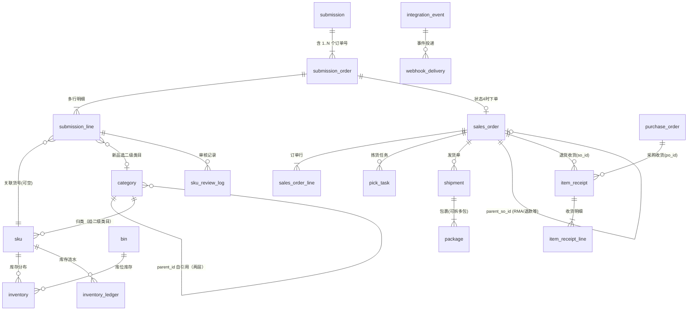

# 跨境代发仓 ERP —— 正式设计文档

| 项 | 内容 |
|---|---|
| **版本** | v1.4（文件名仍为 `_v1.2.md`，重命名需另行授权） |
| **日期** | 2026-09-14 |
| **前置文档** | `代发仓ERP_方案确认纪要_2026-09-14.md` —— **已被用户删除**，其结论已全部并入本文，不再单独维护 |
| **文档状态** | 设计已评审通过；**两端 UI 与中枢均已落地**（P0–P2 完成），剩 P3 与真实联调 |
| **覆盖范围** | 数据模型 · 完整状态机 · 两端页面清单 · 改造路径 |

> **v1.4 变更摘要**：**仓库端 3 屏落地** —— 待处理提交单 / 新品审核 / 类目管理，并新增 wms 侧代理层（§4.2）解决「浏览器不能持有 `X-WMS-Token`」。补 Hub 仓库端货号检索接口（改号/判重依赖它）。
> **v1.3 变更摘要**：补齐**跨系统入站 payload 契约**（§6.1）——修正适配器字段与 `wms/db/mappings/hub.yaml` 不一致的问题；新增 **§5.4.1 实施进展**，记录 P0–P3 实际落地状态与仍未做的事。
> **v1.2 变更摘要**：14 条未决事项**全部裁决完毕**。本版变更：**砍掉 `spu` 层**、`inventory_ledger` 确认保留、**驳回改为按订单**（确认仍为整批）、补初始类目占位表。
> **v1.1 变更摘要**：提交单从「一单一单」改为**「批次含多订单号」**——数据模型增加 `submission_order` 一层、状态机增加订单级子状态、缺货规则改为按订单判定。

> **本文的效力**：原「方案确认纪要」中标注「已确认」的条目，本文全部继承（该纪要文件已被删除，结论已并入本文）。本文只做**落地细化**——把确认过的规则翻译成字段、状态、页面和改造清单。
> **本文现在是本项目的唯一权威设计文档**，后续所有变更直接改本文并记录在「变更记录」。
> 文中标注 **⏳ 待确认** 的条目是本文新提出的判断或发现的新歧义，需要拍板后才能进入开发。
> **截至 v1.2，本文已无 ⏳ 未决项** —— 全部 14 条已裁决，见 §7.3。

---

## 0. 决策摘要（一页速览）

### 0.1 技术栈（全部已拍板）

| 层 | 选型 |
|---|---|
| 数据库 | **PostgreSQL 16** |
| 后端语言 | **Python**（FastAPI 写中枢；仓库端沿用 sentry-wms 的 Flask） |
| 运营端前端 | **React** |
| 仓库端前端 | **React**（复用 sentry-wms 的 admin）+ **React Native / Expo**（PDA） |
| 仓库端底座 | **sentry-wms**（Apache-2.0） |
| 商品主数据 | 表结构借鉴 ModernWMS，实现自研 |
| 部署 | 本地小服务器，统一部署 |

> ⚠️ **一个必须先解决的架构细节**：中枢建议用 FastAPI，而 sentry-wms 是 Flask。同一台服务器上跑两个 Python Web 进程是可行的（Docker Compose 编排，各自独立端口 + 独立连接池），但**不建议把两者塞进同一个进程**。详见 §5.5。

### 0.2 架构

```
运营端（React）          仓库端（React + RN）
      │                        │
      └────── 中枢 ────────────┘
   （提交单 / 状态机 / 货号审核 / 事件）
              │
      ┌───────┴────────┐
   下单（inbound API）  事件回传（Webhook）
      │                │
      └── sentry-wms ──┘
   （收货/上架/拣货/打包/发货/库存/盘点）
```

**中枢层不可省**——开源 WMS 的订单模型要求「建单时货号 + 数量齐全」，本项目是「先建单 → 后定货号 → 最后定数量」三步凑齐，两者不兼容。

### 0.3 本期范围

**做**：正向履约全链路（提交 → 双确认 → 作业 → 发货回传）+ 退货 RMA + 超时提醒 + 两个角色。

**不做**：多平台订单 API 对接、采购单管理、物流面单 API 对接、多租户 SaaS、财务/账务核算。

### 0.4 角色与登录（本期只有两个）

| 角色 | 落在哪 | 能做什么 |
|---|---|---|
| **运营** | **中枢自建**，不依赖 sentry-wms | 提交申请、查状态、两次确认、在状态 ①–③ 取消 |
| **仓库管理员** | sentry-wms 的 `ADMIN` | 仓库端全部功能 + 货号核验 + 新品转正 + 截单 |

- **已确认：仓库侧不需要「非管理员的仓库账号」** → sentry-wms 侧只用 `ADMIN` 一个角色，`user_page_permissions` 本期不配置。
- **已确认：运营端与仓库端使用各自独立的登录体系** —— 两套账号、两套会话，互不打通。运营账号由中枢管理，仓库账号由 sentry-wms 管理。

---

## 1. 系统总览

### 1.1 业务定位

跨境**代发仓 / 一件代发**（3PL 履约）。运营粘贴订单号 → 系统关联产品货号 → 仓库执行 → 结果回传运营。

**明确不做**：不接 TEMU / TikTok Shop / Amazon / Shopee 的订单 API。订单由人工在运营端提交。

### 1.2 分层与工作量

| 层 | 内容 | 工作量 |
|---|---|---|
| 运营端 | 提交发货申请、状态查询、二次确认 | ~20% |
| 中枢 | 提交单、订单号↔货号关联、状态机、货号审核、库存流水、作业单派发与回传 | ~30% |
| 仓库端 | 收货/上架/拣货/打包/发货/库存/库位/盘点 + PDA | ~50% |

### 1.3 端到端链路

| # | 动作 | 操作方 | 系统状态 |
|---|---|---|---|
| 1 | 提交发货申请（**1 个或多个订单号** + 每单多行 + 备注） | 运营 | `1 待仓库处理` |
| 2 | 核验货号；新品建待审核号 → 转正 | 仓库 | `2 待一次确认·货号` |
| 3 | 确认货号关联（可驳回，**最多 3 次**） | 运营 | `3 待二次确认·数量` |
| 4 | 填写每行的发货数量（提交后锁定，**运营此后不能再操作**） | 运营 | `4 待作业` |
| 5 | 向 sentry-wms 下单 → 拣货 / 打包（**逐订单判定，缺货的订单不发**） | 仓库 | `5 作业中` |
| 6 | 发货 → 事件回传；**批次内订单全部发完**才完结 | 仓库 | `6 已发货·完成` |

> 本期**不做采购单管理**——仓库补货走「收货」功能，不进采购单流程。

---

## 2. 数据模型

### 2.1 实体关系总览



> 图中 `sales_order` / `sales_order_line` / `pick_task` / `shipment` / `package` / `item_receipt` / `bin` / `inventory` / `integration_event` / `webhook_delivery` 均为 **sentry-wms 已有表**，本文不改结构（除个别加列）。
> `category` / `sku` / `submission` / `submission_order` / `submission_line` / `sku_review_log` / `inventory_ledger` 为**中枢新增表**。
> **已确认砍掉 `spu` 层**（2026-09-14）——你的类目结构是「二级类目 + 商品名」，没有同款多规格需求，SPU 是多余层级。`sku` 直接挂二级类目。

### 2.2 表定义

#### 2.2.1 商品主数据（中枢新增）

**`category` 类目**

| 字段 | 类型 | 说明 |
|---|---|---|
| `id` | BIGSERIAL PK | |
| `category_name` | VARCHAR(128) NOT NULL | 类目名，如「玻璃杯」 |
| `parent_id` | BIGINT NULL | 自引用，NULL = 根 |
| `code_prefix` | VARCHAR(16) NOT NULL UNIQUE | **编码前缀**，如 `A001`。全库唯一 |
| `seq_counter` | INT NOT NULL DEFAULT 0 | **该类目内已发出的最大序号**。只增不减 |
| `is_active` | BOOLEAN DEFAULT TRUE | |
| `created_at` / `updated_at` | TIMESTAMPTZ | |

- **货号生成**：`code_prefix || '-' || (seq_counter + 1)`
- **并发安全**（关键）：用单条原子语句取号，不做 `SELECT MAX()+1`：
  ```sql
  UPDATE category SET seq_counter = seq_counter + 1
   WHERE id = :category_id
  RETURNING code_prefix || '-' || seq_counter AS new_code;
  ```
  `UPDATE ... RETURNING` 自带行锁，并发下不会取到重号。**再给 `sku.sku_code` 加 UNIQUE 约束兜底**，冲突则重试。
- **号段不复用**：`seq_counter` 只增不减。判重删除的待审核号占用的序号**不回收**，避免历史数据串号。
- **已确认：类目树固定两层**（一级 = `家居用品`，二级 = `杯具`）。**`code_prefix` 只挂在二级类目上**，一级类目的 `code_prefix` 为 `NULL`。
- **第三层「玻璃杯 / 马克杯」是商品名，不是类目** —— 由仓库在商品档案里填写，落在 `sku.item_name`。所以完整表述 `家居用品-杯具-玻璃杯` 里，只有前两段是类目。
- **取号示例**：`家居用品-杯具` 挂前缀 `A001` → `玻璃杯` = `A001-1`，`马克杯` = `A001-2`。同一二级类目下的不同商品名，共享前缀、各自占一个序号。

**初始类目表（占位数据，仓库可自行增改）**

| 一级类目 | 二级类目 | `code_prefix` |
|---|---|---|
| 家居用品 | 杯具 | `A001` |
| 家居用品 | 餐具 | `A002` |
| 家居用品 | 收纳 | `A003` |
| 厨房用品 | 锅具 | `B001` |
| 厨房用品 | 小家电 | `B002` |
| 日用百货 | 清洁用品 | `C001` |
| 日用百货 | 纸品 | `C002` |
| 服饰配件 | 帽子 | `D001` |
| 服饰配件 | 围巾 | `D002` |
| 宠物用品 | 食具 | `E001` |
| 宠物用品 | 玩具 | `E002` |
| 文具 | 笔类 | `F001` |
| 文具 | 本册 | `F002` |

> **前缀规则**：一级类目占一个字母（A、B、C…），二级类目在该字母下顺序编号。新增一级类目按字母顺延（G、H…）。**`code_prefix` 全库唯一**，建类目时由系统校验。
> 这份表只是**占位**，上线前由仓库按实际经营品类替换。

#### 2.2.1b 关于 `spu` 层（已确认：砍掉）

**SPU = Standard Product Unit（标准产品单元），只在「同款多规格」时才需要。**

| 场景 | 需要 SPU 吗 |
|---|---|
| 玻璃杯只有一种规格、一个货号 | ❌ 不需要，SPU 与 SKU 一比一，是多余层级 |
| 玻璃杯有 350ml / 500ml 两个货号，想聚在一起看 | ✅ 需要：玻璃杯(SPU) → A001-1 / A001-2 |

**已确认砍掉 `spu` 表。** 理由：
1. 类目结构是「二级类目 + 商品名」，商品名就是货号的载体，**没有同款多规格的需求**。
2. 商品名由仓库填，仓库可以把 `玻璃杯350ml` / `玻璃杯500ml` 当成**两个商品名**各占一个货号——不需要额外层级。
3. 少一张表、少一层维护，也少一个「建货号时要不要顺带建 SPU」的判断分支。
4. 将来真需要聚合，把 `sku.item_name` 拆成「款名 + 规格名」两个字段即可，**不需要提前建层**。

→ `sku` 直接挂 `category_id`（二级类目）+ `item_name`（商品名），**无 `spu_id`**。

#### 2.2.1c `sku` 货号

| 字段 | 类型 | 说明 |
|---|---|---|
| `id` | BIGSERIAL PK | |
| `sku_code` | VARCHAR(64) NOT NULL **UNIQUE** | **货号**，如 `A001-1` |
| `category_id` | BIGINT NOT NULL FK → category | **挂二级类目** |
| `item_name` | VARCHAR(255) NOT NULL | **商品名**（玻璃杯 / 马克杯），**由仓库填写** |
| `code_status` | VARCHAR(16) NOT NULL DEFAULT 'draft' | **`draft` 待审核 / `active` 正式** |
| `spec_name` | VARCHAR(255) NULL | 规格描述（备用，本期不用） |
| `barcode` | VARCHAR(128) NULL | |
| `weight` / `length` / `width` / `height` | NUMERIC NULL | 计费用 |
| `is_active` | BOOLEAN DEFAULT TRUE | |
| `created_at` / `promoted_at` | TIMESTAMPTZ | `promoted_at` = 转正时间 |

- **「转正」只是 `code_status: draft → active`**，不搬家、不换号。
- `draft` 状态的货号**不允许被其他提交单引用**（引用校验要带上 `code_status='active'`）。
- **商品名由仓库填写**：运营提交新品行时只选二级类目（另可填一段自由描述辅助说明），**正式商品名在仓库审核环节确定**，确定后一起生成货号。

#### 2.2.2 提交单（中枢核心）

**结构（已确认 2026-09-14）**：一张提交单是一个**批次**，默认含 **1 个订单号**，可**新增多个订单号**。**库存与发货按「单个订单」独立判定**（见 §2.2.5）。因此是三张表：

```
submission（批次）  →  submission_order（订单号，1..N）  →  submission_line（明细行，1..N）
```

**`submission` 提交单（批次）**

| 字段 | 类型 | 说明 |
|---|---|---|
| `id` | BIGSERIAL PK | |
| `submission_no` | VARCHAR(64) NOT NULL UNIQUE | 提交单号（系统生成，如 `SUB-20260914-001`） |
| `idempotency_key` | VARCHAR(128) NOT NULL UNIQUE | **幂等键**，防重复提交 / 防双击 |
| `status` | SMALLINT NOT NULL DEFAULT 1 | **批次汇总态** 1–6，见 §3.1 |
| `remark` | TEXT NULL | 批次级备注（可选） |
| `submitted_by` | VARCHAR(128) NOT NULL | 提交人（运营账号） |
| `submitted_at` | TIMESTAMPTZ NOT NULL DEFAULT NOW() | 提交时刻 |
| `status_entered_at` | TIMESTAMPTZ NOT NULL DEFAULT NOW() | 进入当前状态的时间，用于分环节计时 |
| `alert_1h_at` | TIMESTAMPTZ NULL | 1h 提醒已发出时刻（防重复发） |
| `alert_2h_at` | TIMESTAMPTZ NULL | 2h 提醒已发出时刻 |
| `completed_at` | TIMESTAMPTZ NULL | 批次完结时刻 |
| `created_at` / `updated_at` | TIMESTAMPTZ | |

**`submission_order` 订单（每个订单号对应 sentry-wms 的一张 `sales_order`）**

| 字段 | 类型 | 说明 |
|---|---|---|
| `id` | BIGSERIAL PK | |
| `submission_id` | BIGINT NOT NULL FK → submission | |
| `order_no` | VARCHAR(128) NOT NULL | **运营填的订单号**。`UNIQUE(submission_id, order_no)` |
| `external_id` | UUID NOT NULL UNIQUE | **双向映射锚点**，对应 `sales_order.external_id` |
| `status` | VARCHAR(16) NOT NULL DEFAULT 'pending' | `pending` 未下单 / `ordered` 已下单 / `shortage` **缺货待补货** / `shipped` 已发货 / `cancelled` 已取消 |
| `confirm_status` | VARCHAR(16) NOT NULL DEFAULT 'pending' | **货号确认态**：`pending` 待确认 / `confirmed` 已确认 / `rejected` 已驳回（回仓库处理中） |
| `reject_count` | INT NOT NULL DEFAULT 0 | **该订单被驳回的次数，上限 3** |
| `sales_order_id` | BIGINT NULL | 下单成功后回填 |
| `shortage_at` | TIMESTAMPTZ NULL | 进入缺货状态时刻 |
| `shipped_at` | TIMESTAMPTZ NULL | 发货时刻 |
| `created_at` / `updated_at` | TIMESTAMPTZ | |

> **两个状态字段的分工**：`confirm_status` 管**确认阶段**（批次状态 ②），`status` 管**作业阶段**（批次状态 ④ 之后）。两者不会同时活跃。

**`submission_line` 提交单明细行**

| 字段 | 类型 | 说明 |
|---|---|---|
| `id` | BIGSERIAL PK | |
| `submission_order_id` | BIGINT NOT NULL FK → submission_order | **行归属哪个订单号** |
| `line_no` | INT NOT NULL | 行号，从 1 开始。`UNIQUE(submission_order_id, line_no)` |
| `item_id` | BIGINT NULL FK → sku | **货号**。老品填；新品审核前为空 |
| `item_desc` | VARCHAR(255) NULL | **商品名称/描述（自由文本，可留空）** |
| `is_new_item` | BOOLEAN DEFAULT FALSE | **新品申请货号**勾选 |
| `category_id` | BIGINT NULL FK → category | 新品行选的**二级类目** |
| `draft_sku_code` | VARCHAR(64) NULL | 新品生成的**待审核货号** |
| `qty` | INT NULL | **发货数量**。提交时为 NULL，二次确认时填 |
| `qty_locked_at` | TIMESTAMPTZ NULL | 数量锁定时刻 |
| `line_status` | VARCHAR(16) NOT NULL DEFAULT 'pending' | `pending` / `rejected` / `confirmed` |
| `reject_reason` | TEXT NULL | 驳回原因 |
| `created_at` / `updated_at` | TIMESTAMPTZ | |

**校验规则（后端强制）**：
1. `is_new_item = FALSE` → 必须填 `item_id`，且该 `sku.code_status = 'active'`
2. `is_new_item = TRUE` → 必须填 `category_id`（二级类目），`item_id` 必须为空
3. 两个条件互斥，不允许同时成立或同时不成立
4. `item_desc` 允许为空（知道货号就只填货号）
5. `qty` 在状态 1–2 阶段必须为 NULL；状态 3 提交时必须是 `>= 1` 的整数
6. 每个 `submission_order` 至少要有 1 行

> **订单号唯一性**：`order_no` 只在**同一批次内**唯一（`UNIQUE(submission_id, order_no)`），跨批次不限制——同一个订单号将来若因故重提，会产生新的 `submission_order` 行，属于正常情况。防重复提交由 `submission.idempotency_key` 负责。
> **历史提交单**：指的就是「同一个 `order_no` 在不同批次里出现的旧记录」。**允许存在**，列表页按提交时间倒序展示，旧记录只读。

**`submission_line` 提交单明细行**

| 字段 | 类型 | 说明 |
|---|---|---|
| `id` | BIGSERIAL PK | |
| `submission_id` | BIGINT NOT NULL FK | |
| `line_no` | INT NOT NULL | 行号，从 1 开始。`UNIQUE(submission_id, line_no)` |
| `item_id` | BIGINT NULL FK → sku | **货号**。老品填；新品审核前为空 |
| `item_desc` | VARCHAR(255) NULL | **商品名称/描述（自由文本，可留空）** |
| `is_new_item` | BOOLEAN DEFAULT FALSE | **新品申请货号**勾选 |
| `category_id` | BIGINT NULL FK → category | 新品行选的类目 |
| `draft_sku_code` | VARCHAR(64) NULL | 新品生成的**待审核货号** |
| `qty` | INT NULL | **发货数量**。提交时为 NULL，二次确认时填 |
| `qty_locked_at` | TIMESTAMPTZ NULL | 数量锁定时间（二次确认提交时刻） |
| `line_status` | VARCHAR(16) NOT NULL DEFAULT 'pending' | `pending` / `rejected` / `confirmed` |
| `reject_reason` | TEXT NULL | 驳回原因 |
| `created_at` / `updated_at` | TIMESTAMPTZ | |

**校验规则（后端强制）**：
1. `is_new_item = FALSE` → 必须填 `item_id`，且该 `sku.code_status = 'active'`
2. `is_new_item = TRUE` → 必须填 `category_id`，`item_id` 必须为空
3. 两个条件互斥，不允许同时成立或同时不成立
4. `item_desc` 允许为空（知道货号就只填货号）
5. `qty` 在状态 1–2 阶段必须为 NULL；状态 3 提交时必须是 `>= 1` 的整数

#### 2.2.3 货号审核记录

**`sku_review_log`**

| 字段 | 类型 | 说明 |
|---|---|---|
| `id` | BIGSERIAL PK | |
| `submission_line_id` | BIGINT NOT NULL FK | |
| `action` | VARCHAR(24) NOT NULL | `create_draft` 建待审核号 / `promote` 转正 / `merge_duplicate` 判重并删号 / `change_item` 改货号 |
| `from_sku_id` / `to_sku_id` | BIGINT NULL | 改号时记录前后货号 |
| `draft_sku_code` | VARCHAR(64) NULL | 被删除的待审核号（留档，号段不回收） |
| `operator` | VARCHAR(128) NOT NULL | |
| `created_at` | TIMESTAMPTZ | |

- **判重删号**：删 `sku` 里那条 `draft` 记录，把 `submission_line.item_id` 改成已有货号，同时写一条 `merge_duplicate` 日志留档。
- 仓库**可以修改运营填的货号** → 写 `change_item` 日志。

#### 2.2.4 库存与流水

**复用 sentry-wms 的 `inventory` / `bins` / `warehouses`**（不改结构）。

**`inventory_ledger` 库存流水（中枢新增，用于跨系统追溯）**

| 字段 | 类型 | 说明 |
|---|---|---|
| `id` | BIGSERIAL PK | |
| `sku_id` | BIGINT NOT NULL FK | |
| `bin_id` / `warehouse_id` | BIGINT NOT NULL | |
| `delta` | INT NOT NULL | 变动量，正入负出 |
| `balance_after` | INT NOT NULL | 变动后结存（便于对账） |
| `source_type` | VARCHAR(32) NOT NULL | `submission` / `rma_receive` / `cycle_count` / `transfer` |
| `source_id` | BIGINT NOT NULL | 来源单据 ID |
| `operator` | VARCHAR(128) | |
| `created_at` | TIMESTAMPTZ | |

#### 2.2.4b 关于 `inventory_ledger`（已确认：保留）

**它是什么**：库存变动流水。每一笔库存增减记一行——**什么时候、因为哪张单、哪个货号、在哪个库位、变了多少、变完还剩多少**。

| 用途 | 场景 |
|---|---|
| 追溯 | 运营问「我的货怎么少了 20 件」→ 能查到具体是哪张提交单/哪次盘点/哪笔退货导致的 |
| 对账 | 期初 + 本期入库 − 本期出库 = 期末，能对上账 |
| 纠纷 | 与运营核对发货数量时，有流水可举证 |

**为什么不能只靠 sentry-wms**：sentry-wms 的 `inventory` 表只有**当前结存**，没有历史；库存变动是以**事件**形式发出去的（`inventoryadjusted.completed`），事件被消费后就不留痕了。

**我的建议：保留，但数据来源改为订阅事件。** 两种写法的区别：

| 写法 | 覆盖面 |
|---|---|
| (a) 中枢自己在每个动作里记一笔 | ❌ 有漏——sentry-wms 内部触发的变动（盘点调整、库内调拨、退货收货）中枢不知道 |
| (b) 中枢订阅 `inventoryadjusted.completed` 事件后落表 | ✅ 全覆盖，且与 sentry-wms 的真实变动一致 |

> **已确认保留，采用 (b) 方案** —— 订阅 `inventoryadjusted.completed` 事件后落表。这张表严格来说不是「中枢自研」，而是「事件订阅的落地表」，实现量很小。

#### 2.2.5 作业单（复用 sentry-wms，不改）

| 表 | 作用 |
|---|---|
| `pick_task` / `pick_batch` / `wave_pick_orders` / `wave_pick_breakdown` | 拣货任务 + **波次合并**（多单合一波） |
| `pack_*` | 打包 |
| `shipment` / `package` | 发货 + **拆多包裹**（`ship.confirmed` 事件原生带 `packages[]`） |
| `cycle_count*` | 盘点 |
| `transfer_orders` | 库内调拨 |

> **「不能部分发货」如何落地（已确认 2026-09-14）**：sentry-wms 的 `sales_order_lines` 有 `quantity_ordered` / `quantity_allocated` / `quantity_picked` / `quantity_packed` / `quantity_shipped` 五个数量列，**原生支持部分发货**，本项目要在**中枢侧**收紧。
>
> **规则：以「单个订单」为最小发货单位 —— 全有才发，缺一不发。**
> - 一个订单里所有行都满足库存 → 整单发货
> - 任一行库存不足 → **该订单不发**，标记 `shortage` 等待补货
> - **其他订单不受影响**，照常作业、照常发货
>
> 运营端**不暴露任何「部分发货」入口**；仓库端也不做部分发货。

#### 2.2.6 退货 RMA（复用 sentry-wms，本期就做）

**核心设计：退货不是新单据，是「订单的一种类型」。**

| 项 | 做法 |
|---|---|
| 退货单 | 一张 `sales_order`，`order_type = 'return'`，`so_number = <原单号>-RMA` |
| 关联原单 | `sales_order.parent_so_id` |
| 明细行 | `sales_order_lines`，行上记 `quantity_ordered`（预计退量）+ `original_so_line_id`（指回原单行） |
| 建单副作用 | **无**。不动钱、不动货（源码注释：goods move at receiving） |
| 收货 | 复用 `item_receipts`，填 `so_id` / `so_line_id`（PO 收货则填 `po_id`） |
| 处置 | **由入哪个库位决定**：可售位 → 回库存；不良品/开箱位 → 隔离。不设独立「处置方式」字段 |
| 状态 | `OPEN → PARTIALLY_RECEIVED → RECEIVED` |
| 幂等 | `idempotency_key` 直接当 `item_receipts.external_id`（该列 UNIQUE），重复提交返回上次结果并标 `replayed: true` |
| 超收保护 | `remaining = quantity_ordered - quantity_received`，超出直接报错 |
| 收货记录 | **append-only，无作废路径**。收错 → 建**冲正 RMA**，绝不 void |
| 整单作废 | `voided_at` / `voided_by` 软删除。门槛：**仅 OPEN、未收货、无关联退款**；仅仓库管理员可操作 |

**事件**：`return.received`，每个 `item_receipts` 行发一条，带 `so_external_id`（退货单）+ `parent_so_external_id`（原单）+ `warehouse_code` / `bin_code`（处置信号）。

> **本项目简化**：sentry-wms 的事件里带 `bin_code` 是给下游账务系统映射会计科目的。本项目不做账务，所以 `bin_code` 只用于内部区分「回可售」还是「进隔离」，不做 GL 映射。

#### 2.2.7 事件与集成（复用 sentry-wms）

| 表 / 机制 | 作用 |
|---|---|
| `integration_events` | 事务性 outbox，事件先落库再投递（**保证不丢**） |
| `webhook_subscriptions` / `webhook_deliveries` | 订阅与投递记录、重试 |
| `consumer_groups` | 消费位点，支持重放 |
| `cross_system_mappings` | `external_id` 双向映射 |
| `api/schemas_v1/events/*` | 15 种事件的 JSON Schema，**版本化管理** |

**本项目需要订阅的事件**：

| 事件 | 中枢动作 |
|---|---|
| `pick.confirmed` | 按 `external_id` 定位到 `submission_order` → 记录拣货完成时间（批次仍停在 ⑤） |
| `pack.confirmed` | 记录打包完成时间 |
| `ship.confirmed` | `submission_order.status → shipped`；取 `packages[]` 落包裹与物流单号；**当该批次下所有订单都进入 `shipped` 或 `cancelled` 时，提交单 → ⑥** |
| `backorder.opened` | 对应 `submission_order.status → shortage`（缺货待补货）；告警推送仓库端 + 运营端 |
| `backorder.fulfillable` | 对应订单 `shortage → ordered`，自动恢复继续作业 |
| `return.received` | 退货收货，写 `inventory_ledger` |

---

## 3. 状态机

### 3.1 提交单主状态机

```
                  ┌────────── 驳回（按订单，运营）──────────┐
                  │                                        │
   [提交]         ▼                                        │
  运营 ──▶ ① 待仓库处理 ──核验通过──▶ ② 待一次确认·货号 ──整批确认──▶ ③ 待二次确认·数量
              （仓库）                  （运营）                       （运营）
              ▲                                                         │
              └── 被驳回的订单改完号，回到待确认                   提交数量（锁定）
                                                                        ▼
              ⑥ 已发货·完成 ◀──批次内订单全发完── ⑤ 作业中 ◀──下单成功── ④ 待作业
                  （系统回传）                    （仓库）      （系统，逐订单建 sales_order）
```

**状态转移表**

| # | 当前状态 | 动作 | 操作方 | 前置条件 | 下一状态 | 副作用 |
|---|---|---|---|---|---|---|
| 1 | ① 待仓库处理 | 核验通过 | 仓库 | 每行货号有效（`code_status='active'`）或新品行已选类目 | ② | 新品行生成 `draft` 货号 |
| 2 | ① 待仓库处理 | 修改货号 | 仓库 | — | ①（不变） | 写 `sku_review_log(change_item)` |
| 3 | ① 待仓库处理 | 判重删号 | 仓库 | 新品被判为重复品 | ①（不变） | 删 `draft` 货号；该行改用已有货号；写日志 |
| 4 | ① 待仓库处理 | 被驳回的订单处理完毕 | 仓库 | 批次内已无 `rejected` 订单 | ② | 被驳回订单 `confirm_status: rejected → pending` |
| 5 | ② 待一次确认·货号 | **整批确认** | 运营 | 批次内**无** `rejected` 订单 | ③ | 所有 `pending` 订单 → `confirmed` |
| 6 | ② 待一次确认·货号 | **按订单驳回** | 运营 | **必须填原因**；该订单 `reject_count < 3` | **①** | 该订单 `confirm_status → rejected`、`reject_count + 1`；**批次回到 ①** 等仓库改号 |
| 7 | ③ 待二次确认·数量 | 提交数量 | 运营 | 每行 `qty >= 1` | ④ | 锁定 `qty`，写 `qty_locked_at` |
| 8 | ④ 待作业 | 下单成功 | 系统 | — | ⑤ | 逐订单调 sentry-wms inbound API 建 `sales_order`，回填 `sales_order_id` |
| 9 | ④ 待作业 | 下单失败 | 系统 | — | ④（不变） | 告警 + 重试；**不推进状态** |
| 10 | ⑤ 作业中 | 拣货完成 | 系统 | 收到 `pick.confirmed` | ⑤（不变） | 记录节点时间 |
| 11 | ⑤ 作业中 | 某订单发货 | 系统 | 收到 `ship.confirmed` | ⑤（不变） | 该订单 → `shipped`；落包裹 + 物流单号 |
| 12 | ⑤ 作业中 | 批次内订单全部完结 | 系统 | 所有订单 ∈ {`shipped`, `cancelled`} | ⑥ | 写 `completed_at` |

**确认与驳回的粒度（已确认 2026-09-14）**：

| 操作 | 粒度 | 说明 |
|---|---|---|
| **确认货号关联** | **整批** | 一次点掉，把所有待确认订单一起确认 |
| **驳回** | **按订单** | 哪个订单的货号有问题就驳哪个，其余订单不受影响 |

- 运营驳回后，**批次回到 ①**（因为仓库确实有货号要重新处理），但**其他订单的 `confirmed` 状态保留**，仓库处理完只需运营确认被驳回的那几个。
- 驳回**不清空**已填货号，仓库在原有基础上改。
- **驳回次数是订单级的**：同一个订单最多被驳回 3 次；达到 3 次后该订单的驳回按钮置灰，需联系仓库管理员。

**不可逆规则**：
- 状态只能**单向前进**（①②③④⑤⑥），唯一的回退是 **② → ①**（驳回）。
- **数量一旦锁定（状态 3 提交）不可再改**。要改只能整批取消后重提。
- **货号关联锁定在状态 2 确认之后**，仓库此后不能再改号（改了会让运营确认过的内容与实际不符）。

### 3.1b 订单级子状态（因为「一张提交单含多个订单号」）

批次状态 ①–⑥ 描述的是**整批的确认进度**；而「发货」是按**单个订单**判定的，所以每个 `submission_order` 另有自己的状态：

| `submission_order.status` | 含义 | 进入条件 |
|---|---|---|
| `pending` | 未下单 | 初始状态（批次还在 ①–④） |
| `ordered` | 已下单，正常作业中 | 批次进入 ⑤ 后逐单回填 |
| `shortage` | **缺货待补货** | 收到 `backorder.opened` |
| `shipped` | 已发货 | 收到 `ship.confirmed` |
| `cancelled` | 已取消 | 人工取消 |

**另一个订单级字段 `confirm_status`**（只在批次状态 ①–② 活跃）：

| `confirm_status` | 含义 |
|---|---|
| `pending` | 待运营确认货号 |
| `confirmed` | 运营已确认该订单的货号 |
| `rejected` | 运营已驳回，等仓库改号 |

**批次状态推进条件**：
```
批次 ① → ②：仓库核验通过，且批次内无 rejected 订单
批次 ② → ③：批次内所有订单 confirm_status = confirmed
批次 ⑤ → ⑥：批次内所有订单 status ∈ {shipped, cancelled}
```
也就是说：**只要还有一个订单没确认完，批次就停在 ②；只要还有一个订单缺货没发，批次就停在 ⑤**——这是正确的语义。

**缺货订单怎么恢复**：
1. 收到 `backorder.opened` → 该订单 `shortage`，通知仓库 + 运营
2. 仓库补货入库（走收货，不走采购单）
3. sentry-wms 发 `backorder.fulfillable` → 该订单 `shortage → ordered`，自动继续作业
4. 若运营决定不等了 → 人工把该订单置 `cancelled`，批次照常推进

> 这套机制 sentry-wms **原生支持**（`backorder.opened` / `backorder.fulfillable` 两个事件就是为它设计的），不需要自研。

### 3.2 异常分支

#### 3.2.1 取消（运营侧已确认；⑤ 截单为我提出）

| 当前状态 | 能否取消 | 谁 | 后果 |
|---|---|---|---|
| ① ② ③ | ✅ 可以 | 运营 | 状态 → `CANCELLED`。无库存副作用 |
| ④ 待作业 | ❌ **运营不可** | 仓库管理员 | 数量已锁定，**运营不能再操作该批次**；如需取消须联系仓库 |
| ⑤ 作业中 | ⚠️ 仅「未发货」可截单 | 仓库管理员 | 若已有拣货/打包动作，需人工回库 |
| ⑥ 已发货·完成 | ❌ 不可 | — | 只能走**退货 RMA** |

- 取消需填原因，写审计日志。
- **运营的操作边界（已确认 2026-09-14）**：运营提交数量之后，**对这批订单就不能再做任何操作**——不能改数量、不能改货号、不能取消。要变动只能找仓库管理员。
- 状态 ⑤ 的截单要在 sentry-wms 侧取消对应 `sales_order`，并释放已分配库存。

#### 3.2.2 驳回（已确认：整批确认 + 按订单驳回）

| 项 | 规则 |
|---|---|
| 触发点 | 批次状态 **② → ①** |
| **粒度** | **按订单** —— 只驳有问题的那个订单，其余订单不受影响 |
| 前置条件 | **必须填驳回原因**；该订单 `reject_count < 3` |
| 已填货号 | **保留，不清空**；仓库在原有基础上改 |
| 其他订单 | 已 `confirmed` 的订单**保持确认态**，仓库处理完只需运营确认被驳回的那几个 |
| 次数限制 | **订单级，最多 3 次**。达到后该订单的驳回按钮置灰，需联系仓库管理员 |
| 超时 | 驳回后批次回到 ①，**责任方变为仓库**，计时重置（见 §3.2.5） |

#### 3.2.3 退货（本期做，见 §2.2.6）

退货单独立于提交单，走 `sales_order(order_type='return')` 那一套，状态 `OPEN → PARTIALLY_RECEIVED → RECEIVED`，整单可软删除（`voided_at`）。**不与提交单状态机耦合**——退货是原单已完结之后的事。

#### 3.2.4 缺货（已确认）

sentry-wms 收到订单后会做库存分配，缺货时发 `backorder.opened` 事件。

**规则：以「单个订单」为最小发货单位 —— 全有才发，缺一不发。**

| 情况 | 处理 |
|---|---|
| 某订单里有行库存不足 | **该订单不发**，`submission_order.status → shortage`；其他订单照常作业发货 |
| 批次内有订单缺货 | 提交单**停在 ⑤ 作业中**（因为货确实没发完）；仓库端 + 运营端同时告警 |
| 补货到齐 | sentry-wms 发 `backorder.fulfillable` → 该订单自动恢复 `ordered`，继续作业 |
| 运营决定不等 | 人工把该订单置 `cancelled`；批次内其余订单不受影响 |

**不引入部分发货**——已确认「一个 SKU 行不能部分发货」。

#### 3.2.5 超时与提醒（已确认）

**1 小时提醒当前该动的责任方；2 小时两侧同时提醒并标红。**

| 状态 | 计时起点 | 责任方（1h 提醒对象） | 2 小时 |
|---|---|---|---|
| ① 待仓库处理 | 运营提交时刻 / 被驳回后回到 ① 的时刻 | **仓库侧** | 两侧同时提醒 + **标红** |
| ② 待一次确认·货号 | 进入 ② 的时刻 | 有 `rejected` 订单 → **仓库侧**；否则 → **运营侧** | 两侧同时提醒 + **标红** |
| ③ 待二次确认·数量 | 进入 ③ 的时刻 | **运营侧** | 两侧同时提醒 + **标红** |
| ④ 待作业 | 进入 ④ 的时刻 | **仓库侧** | 两侧同时提醒 + **标红** |

- 实现：`submission.status_entered_at` 记录进入时刻，`alert_1h_at` / `alert_2h_at` 记录已发时刻防重复。
- 由一个定时任务（每 5 分钟）扫描，sentry-wms 已有 job 框架（`api/jobs/`）可挂。
- **重置时机**：状态推进、运营驳回、仓库处理完被驳回订单——任一都会重置 `status_entered_at` 和两个 alert 标记。
- ⑤ 作业中之后不再计时（已进入仓库作业，不再属于「未处理」）。

### 3.3 货号状态机

```
  新建（新品审核触发）
        │
        ▼
   draft 待审核 ──判重──▶ 删除（号段不回收）
        │
     确认非重复品
        ▼
   active 正式 ──▶ 可被提交单引用
```

- `draft` 期间该货号**不可被任何提交单引用**。
- `draft → active` 只改 `code_status`，**不换号**。
- `active` 货号**不允许删除**（有历史单据引用），只能 `is_active = false` 停用。

### 3.4 作业单状态（sentry-wms 侧，沿用不改）

`sales_order.status`：`OPEN → ALLOCATED → PICKING → PICKED → PACKING → PACKED → SHIPPED`（+ `CANCELLED` / `REFUNDED` / `BACKORDER`）。

**中枢不直接改这个状态**——只通过事件订阅感知，按 `external_id` 映射到自己的 `submission_order.status`：

| sentry-wms `sales_order.status` | → `submission_order.status` |
|---|---|
| `OPEN` / `ALLOCATED` / `PICKING` / `PICKED` / `PACKING` / `PACKED` | `ordered` |
| `BACKORDER` | `shortage` |
| `SHIPPED` | `shipped` |
| `CANCELLED` | `cancelled` |

批次级 ①–⑥ 则按 §3.1b 的判定条件从订单级**汇总推导**，不单独维护。

### 3.5 退货单状态

`OPEN → PARTIALLY_RECEIVED → RECEIVED`，可 `voided`（软删除，仅管理员、仅未收货）。

---

## 4. 页面清单

### 4.1 运营端（3 屏）

#### 屏 1：提交发货申请

**页面结构（已确认 2026-09-14）**：默认显示 **1 个订单号区块**，可 `+ 新增订单号` 加更多。每个订单号区块内挂自己的明细行。

| 层级 | 字段 | 控件 | 校验 |
|---|---|---|---|
| 提交单 | 备注 | 多行文本 | 可选，说明整批买的是什么 |
| **订单区块** | **订单号** | 文本 | **必填**，≤128；**同一批次内不可重复** |
| 明细行 | 行号 | 只读 | 自动 |
| 明细行 | **货号** | **检索选择框** | 老品行必填 |
| 明细行 | **商品名称/描述** | 文本 | **可留空** |
| 明细行 | 新品申请货号 | 复选框 | 勾选后货号框禁用 |
| 明细行 | **二级类目** | 树形选择 | 勾选新品时必填（**只能选到二级**） |
| 明细行 | 数量 | **不渲染** | — |

**操作**：`+ 新增订单号` / `+ 添加行` / `删除行` / `删除订单号` / `提交`

**货号检索交互**（本屏关键）：
1. 运营在货号框输入**商品名关键词**
2. 下拉实时弹出匹配的 `active` 货号列表：`A001-1 ｜ 玻璃杯`
3. 选中后回填货号；**`item_desc` 自动带出该货号的商品名**（运营可改可清空）

**提交时**：前端生成 `idempotency_key`（`提交时刻 + 订单号集合的哈希`），后端唯一约束拦重复。**整个批次一次提交**，提交后进入状态 ①。

#### 屏 2：我的申请（列表与状态查询）

**列表以「提交单（批次）」为单位**，展开可见批次内的订单号。

| 列 | 说明 |
|---|---|
| 提交单号 | `SUB-20260914-001` |
| 订单号 | 批次内订单号（1 个直接显示，多个显示 `订单A 等 3 个`） |
| 提交时间 | |
| 当前状态 | ①–⑥ 徽标 |
| **订单进度** | 如 `2/3 已发货`、`1 个缺货待补货` |
| **超时** | 超过 1h 标黄、超过 2h **标红** |
| 操作 | 查看详情 / 去确认（状态 ②③）/ 取消（**仅状态 ①–③**） |

**筛选**：状态、时间范围、订单号模糊搜索、是否有缺货订单。
**默认排序**：需要我处理的（②③）置顶，其次按提交时间倒序。

#### 屏 3：确认页（两个阶段合一屏，按状态切换）

**阶段 A —— 一次确认（状态 ②）**

按订单号分组展示，每个订单区块带一个**确认状态徽标**（待确认 / 已确认 / 已驳回），组内是该订单的明细行。

| 展示 | 说明 |
|---|---|
| 每行：货号 / 商品名称 / 新品标记 / 二级类目 | **全部只读** |
| 数量列 | **不显示**，仅提示「待第二次确认时填写」 |
| 订单区块头 | 订单号 + `confirm_status` 徽标 + 已驳回次数（如 `已驳回 1/3`） |

**操作**：
- 底部 **`确认货号关联`** —— **整批确认**，一次把所有待确认订单确认掉。
  **若批次内还有「已驳回」的订单，按钮禁用**，提示「还有 N 个订单在处理中」。
- 每个订单区块内 **`驳回`** —— **按订单驳回**，弹窗必填原因。
  驳回后批次回到状态 ①，该订单标「已驳回」，**其他已确认的订单保持确认态**。

**驳回限制**：**订单级最多 3 次**；达到后该订单的驳回按钮置灰，提示「请联系仓库管理员」。

**阶段 B —— 二次确认（状态 ③）**

| 字段 | 说明 |
|---|---|
| 每行：货号 / 商品名称 | 只读 |
| **每行：发货数量** | **可编辑，`>= 1`** |
| 提示 | 「提交后数量将锁定，且**本批次将不能再由你操作**」 |

**操作**：`提交并锁定`

### 4.2 仓库端 PC（14 屏）

| # | 屏 | 来源 | 关键字段 / 操作 |
|---|---|---|---|
| 1 | **待处理提交单** | ✅ `HubSubmissions.jsx` | 状态 ①/② 队列；核验弹窗按订单分组列出明细行；操作：核验通过（新品行须填正式商品名）、改号、判重删号、被驳回批次的「返工完成」 |
| 2 | **新品审核** | ✅ `HubSkuReview.jsx` | 待审核货号列表（`code_status='draft'`）；操作：**转正**（转正即推送 sentry-wms 的 `items`）。判重删号需要提交单行上下文，故放在屏 1 的核验弹窗里 |
| 3 | **类目管理** | ✅ `HubCategories.jsx` | 两层类目树 + 新增一/二级类目；`category_name` / `parent_id` / **`code_prefix`** / `seq_counter`（只读，只增不减） |
| 4 | **商品档案** | 复用改造 | `items` 列表 + 新增 `category_id` / `code_status` / `spec_name` 字段；停用 / 编辑 |
| 5 | **收货** | 复用 | sentry-wms `receiving`。PO 收货 + **退货收货（`so_id`）** |
| 6 | **上架** | 复用 | sentry-wms `putaway`，扫货 → 推荐库位 → 确认 |
| 7 | **库位管理** | 复用 | `bins` / `binproperty` / `binsize` |
| 8 | **库存查询** | 复用 | 按 SKU / 库位 / 货主查；含 `inventory_ledger` 流水页 |
| 9 | **拣货（波次）** | 复用 | `wave_pick_orders`；多单合并一波；扫码校验 |
| 10 | **打包** | 复用 | 扫描校验；**支持拆多包裹** |
| 11 | **发货** | 复用改造 | **物流单号手工录入**（不接 API）；打印面单（可选） |
| 12 | **盘点** | 复用 | `cycle_count` |
| 13 | **退货 RMA** | 复用 | RMA 列表（`order_type='return'`）；新建 RMA、逐项收货、选处置库位、作废（仅管理员） |
| 14 | **用户与权限** | 复用 | ADMIN/USER + 页面级授权；本期只需 ADMIN 可用 |

### 4.3 仓库端 PDA

| 屏 | 场景 |
|---|---|
| 扫码收货 | 扫箱码/货号 → 录数量 |
| 扫码上架 | 扫货 → 扫库位 → 确认 |
| 扫码拣货 | 按波次/任务逐个货位扫码，校验货号与数量 |
| 扫码打包 | 扫货校验 → 确认包裹 |
| 扫码发货 | 扫包裹 → 录物流单号 |
| 库位查询 | 扫库位看库存 |
| 盘点录入 | 扫库位 → 逐项录实数 |
| 退货收货 | 扫退货单 → 逐项收货 → 选处置库位 |

> PDA 端 sentry-wms 已用 **React Native + Expo** 实现，扫码收货/上架/拣货/打包/发货/盘点都在，本项目**直接复用**，只加「退货收货」一屏。

> **仓库端 3 屏如何访问中枢（实现细节）**：中枢的仓库端接口用共享密钥 `X-WMS-Token` 认证，浏览器既不该也不能持有它。因此在 wms 后端加了一层代理 `wms/api/routes/admin/admin_hub.py`：
> ```
> admin 前端 → /api/admin/hub/*（同源 cookie 会话 + page_key 鉴权）
>            → wms 后端代理（注入 X-WMS-Token）
>            → 中枢 /api/v1/warehouse/*
> ```
> 代理只转发**白名单内的路径形状**（精确正则，不做前缀匹配），并原样透传中枢的状态码与 JSON，所以前端拿到的错误结构与直连中枢一致。密钥始终留在服务器侧。环境变量：`HUB_BASE_URL`（默认 `http://backend:8000`）与 `HUB_WMS_TOKEN`（**刻意复用 `WMS_API_TOKEN`**，避免两边配错）。

---

## 5. 改造路径（基于 sentry-wms）

### 5.1 直接复用（零改动）

| 模块 | sentry-wms 对应 |
|---|---|
| 收货 | `api/routes/receiving.py` |
| 上架 | `api/routes/putaway.py` |
| 拣货 + **波次合并** | `api/routes/picking.py` + `wave_pick_orders` / `wave_pick_breakdown` |
| 打包（支持拆多包裹） | `api/routes/packing.py` |
| 发货 | `api/routes/shipping.py` |
| 库存 / 库位 / 调拨 | `api/routes/inventory.py` / `warehouses.py` / `transfers.py` |
| 盘点 | `cycle_count*` |
| **事件总线** | `integration_events`（事务性 outbox）+ `webhook_subscriptions` + `webhook_deliveries` + `consumer_groups` |
| **幂等机制** | 已有的 `idempotency_key` 处理 |
| **external_id 双向映射** | `cross_system_mappings` |
| **权限** | `users` + `user_page_permissions` |
| React 管理台框架 | `admin/src` 的 DataTable / Modal / StatusTag / PageHeader 等组件 |
| **React Native PDA** | `mobile/`（扫码收货/上架/拣货/打包/发货/盘点） |
| 审计日志（含防篡改哈希链） | `audit_log` |
| **inbound API**（给外部系统推订单） | `api/routes/inbound.py` + `inbound_openapi.py` |

### 5.2 需要改造

| # | 改动点 | 说明 |
|---|---|---|
| 1 | `items` 表加列 | 加 `category_id`（FK → 中枢 `hub.category`）、`code_status`、`spec_name`。原 `items.category` 是自由文本，迁移时把已有值刷进类目表 |
| 2 | 发货页 | **物流单号改手工录入**；本期不接 `dockd` 的承运商集成 |
| 3 | 拣货 / 打包 | 加「**整行不发**」的异常入口（缺货行标记，不引入部分发货） |
| 4 | 权限配置 | 本期仓库侧只用 `ADMIN`；`USER` + 页面授权先不配 |
| 5 | 退货 RMA | 已有的 `order_type='return'` 全套够用，只需补「处置库位选择」的中文文案与操作引导 |

### 5.3 全新自研（中枢 + 运营端）

| # | 模块 | 内容 |
|---|---|---|
| 1 | 商品主数据 | `hub.category`（**两层**）+ `hub.sku` + **货号生成服务**（原子取号） |
| 2 | 提交单 | `hub.submission` / `hub.submission_order` / `hub.submission_line` / `hub.sku_review_log` |
| 3 | 状态机 | ①–⑥ 转移 + 驳回 + 取消 + 超时重置 |
| 4 | 超时提醒任务 | 定时扫描 + 1h/2h 分级提醒 |
| 5 | **下单适配器** | 状态 ④→⑤：把提交单翻译成 `sales_order` 推给 sentry-wms inbound API |
| 6 | **事件消费端** | `POST /webhooks/sentry` 接收 + 验签 + 去重 + 状态映射 |
| 7 | 库存镜像流水 | `hub.inventory_ledger` |
| 8 | **运营端整套** | 3 屏 React 应用（提交 / 列表 / 确认） |
| 9 | **仓库端补 3 屏** ✅ | 待处理提交单、新品审核、类目管理（已实现，经 `wms/api/routes/admin/admin_hub.py` 代理接入；见 §4.2） |

### 5.4 分阶段实施

| 阶段 | 内容 | 完成标志 |
|---|---|---|
| **P0 地基** | Docker Compose 起 PG16 + sentry-wms，跑通全链路；建 `hub` schema；商品主数据**两表**（`category` + `sku`）+ 货号生成服务；类目管理屏 | 能手工建类目、生成 `A001-1`、转正 |
| **P1 中枢主干** | 提交单三表 + 状态机 ①–③；运营端 3 屏 | 运营能提交、仓库能核验、运营能双确认 |
| **P2 仓库接入** | 待处理提交单屏 + 新品审核屏；下单适配器；事件消费端；发货页改造 | 状态 ④→⑤→⑥ 全自动跑通，发货后运营端自动显示完成 |
| **P3 退货与收尾** | RMA 落地 + PDA 退货屏；缺货异常处理；盘点；权限收尾 | 退货全链路可用 |

> **P2 是风险最高的一段**——它同时涉及「推」和「拉」两个方向的跨系统集成。建议 P2 一开始就先把 `ship.confirmed` 这一条事件打通（最长的链路），验证通了再补其余事件。

#### 5.4.1 实施进展（2026-09-14 记录）

| 阶段 | 状态 | 落地内容 |
|---|---|---|
| P0 | ✅ 完成 | `hub` schema 11 张表（`db/migrations/001_hub_schema.sql`）；原子取号；占位类目 seed；结构自检脚本。设计约定的层级/取号/删号规则已固化为 **DB 约束 + 触发器**，不只靠应用层 |
| P1 | ✅ 完成 | 提交单三表 + 状态机 ①–③ 接口；运营端 3 屏（`frontend-ops`） |
| P2 | ✅ 完成 | 仓库端核验/转正/改号/判重/派发/截单接口；**仓库端 3 屏已实现**（待处理提交单 / 新品审核 / 类目管理，含 wms 侧代理层与 `hub-warehouse` page_key）；下单适配器；Webhook 消费端（HMAC 验签 + `event_id` 去重 + 状态映射）；超时提醒已由后台每 5 分钟自动扫描（`TIMEOUT_SCAN_INTERVAL_SECONDS`，设 0 关闭） |
| P3 | ⚠️ 未完成 | **中枢侧无退货接口**——退货仍完全由 sentry-wms 原生承载（`order_type='return'`），中枢只订阅 `return.received` 写流水。缺货异常、盘点、权限收尾随 wms 原生能力可用 |

> **仍未做的事**：`hub.yaml` + inbound token + webhook 订阅在**真实环境从未跑过一次联调**（本机无 Docker）。`make hub-init` 已把「拷映射文件 + 注册 inbound 来源」两步自动化，签发 token 与建 webhook 订阅仍需在 Admin 后台手工完成，步骤见 `wms/docs/hub-integration.md` §3 / §6。
> **回归防线**：`backend/tests/test_adapter_contract.py` 直接读 `wms/db/mappings/hub.yaml.template` 反查适配器真实发出的 payload，映射与适配器一旦漂移即测试失败。仓库端 3 屏落地后，`wms/admin` 的 193 个既有测试全部通过（30 个文件）、`vite build` 通过。

### 5.5 部署架构（已确认）

**建议：同一个 PostgreSQL 实例、同一个 database，中枢表放独立 `hub` schema。**

```
┌──────────────────────── PostgreSQL 16 ────────────────────────┐
│  public schema            │  hub schema                       │
│  （sentry-wms 的 65 张表）  │  （中枢的 category/sku/           │
│                           │   submission/submission_line/...）  │
└───────────────────────────────────────────────────────────────┘
        ▲                                  ▲
        │                                  │
  sentry-wms（Flask）              中枢（FastAPI）
  :5000                             :8000
```

**为什么同库 + 跨 schema**：
- 同库才能用 **FK** 保证 `submission_line.item_id → hub.sku.id` 的完整性，也才能在同一事务里「原子取号 + 建 SKU」。
- 独立 schema 让两套迁移体系互不干扰——sentry-wms 的 74 个手写 SQL 只动 `public`，中枢的迁移只动 `hub`。
- 将来要拆库，只需把 `hub` schema 导出即可，改动面小。

**为什么中枢独立进程而不是塞进 sentry-wms**：
- 两套框架（FastAPI vs Flask）不适合同进程。
- 独立部署让中枢可以单独重启、单独扩容，也不受 sentry-wms 升级影响。
- 连接池分开配，避免互相抢连接。

**已确认：中枢用 FastAPI**（不改成 Flask）。Pydantic 校验 + 自动 OpenAPI 文档对纯 API 服务更顺手，且独立进程便于将来拆分。

---

## 6. 关键机制

### 6.1 下单适配器（中枢 → sentry-wms）

**触发点**：提交单 ④ → ⑤。

**前置要求（关键）**：sentry-wms 的订单行要求 `item_id` **必须已存在**。所以：

> **货号一旦 `active`，必须立即推送到 sentry-wms 的 `items`**，不能等到下单时才推。
> 推送时机：① 新品转正时；② 仓库新建商品档案时。

**调用参数映射** —— **每个 `submission_order` 对应一张 `sales_order`**，批次含 N 个订单号就调 N 次：

| 提交单字段 | → sentry-wms 字段 |
|---|---|
| `submission_order.external_id` | `sales_order.external_id`（建立双向映射） |
| `submission_order.external_id` + `external_version` | 幂等键 `(source_system, external_id, external_version)`；**每个订单号一个 `external_id`**，重试时 `external_version` 递增 |
| `submission_order.order_no` | `so_number` |
| `submission.remark` | `sales_order.memo` |
| `submission_line` 的货号 | `lines[].sku_code` → 由 WMS 经 `cross_system_mappings` 解析为 `sales_order_line.item_id` |
| `submission_line.qty` | `sales_order_line.quantity_ordered` |
| `submission_line.line_no` | `sales_order_line.line_number` |

**入站 payload 契约（必须与 `wms/db/mappings/hub.yaml` 一致）**：

| 资源 | 信封 `external_id` | `source_payload` 必需字段 |
|---|---|---|
| `items` | **`sku_code`**（如 `A001-1`） | `sku_code` / `item_name` / `category_id` / `code_status` |
| `sales_orders` | `submission_order.external_id` | `order_no`、`lines[].line_no`、`lines[].sku_code`、`lines[].qty` |

> ⚠️ **两个易错点**（2026-09-14 修复）：
> 1. `items` 的信封 `external_id` 必须是 **`sku_code`**，不能是中枢内部的 UUID——sentry-wms 用它写入 `cross_system_mappings.source_id`，而订单行的货号解析正是按 `sku_code` 查这张表。
> 2. 订单行**不传 `item_id`**：WMS 通过 `lines[].sku_code` 走 `cross_system_lookup` 解析成自己的 `item_id`。因此**货号必须先推 `items`**，否则下单返回 `409 cross_system_lookup_miss`。

**失败处理**：下单失败**不推进状态**，保持 ④，写告警 + 定时重试。绝不允许「状态显示已下单但 WMS 里没有单」。

### 6.2 事件回传（sentry-wms → 中枢）

- 中枢暴露 `POST /webhooks/sentry`，注册为 sentry-wms 的 webhook 订阅者。
- **验签**：用 sentry-wms 的 HMAC 签名机制（`api/services/webhook_dispatcher/signing.py`）。
- **去重**：按 `event_id` 幂等，重复投递直接丢弃。
- **乱序容忍**：事件可能乱序到达，状态推进**只向前不向后**（比较序号，小于当前状态的事件只记录不推进）。

| sentry-wms 事件 | 中枢动作 |
|---|---|
| `pick.confirmed` | 记录拣货完成时间（状态仍 ⑤） |
| `pack.confirmed` | 记录打包完成时间 |
| `ship.confirmed` | 状态 → ⑥；落 `packages[]` 与物流单号 |
| `backorder.opened` | 缺货告警，推送两端 |
| `return.received` | 写 `hub.inventory_ledger` |

### 6.3 幂等设计汇总

| 场景 | 幂等键 | 存储位置 |
|---|---|---|
| 运营提交申请 | `idempotency_key` | `hub.submission.idempotency_key` UNIQUE |
| 向 sentry-wms 下单 | 同上，透传 | sentry-wms 侧 |
| 退货收货 | 同上，透传 | `item_receipts.external_id` UNIQUE |
| 接收 webhook | `event_id` | 中枢去重表 |

### 6.4 库存锁定与并发

- **由 sentry-wms 的 allocation 机制负责**，中枢不重复实现。
- 中枢只在展示层反映分配结果。
- **唯一需要中枢自己保证并发安全的地方是「货号取号」**（见 §2.2.1 的原子 UPDATE 方案）。

---

## 7. 附录

### 7.1 术语表

| 术语 | 含义 |
|---|---|
| **货号** | `sku_code`，格式 `类目前缀-序号`，如 `A001-1` |
| **提交单 / 批次** | `submission`，中枢承接运营申请的容器，**默认含 1 个订单号，可含多个** |
| **订单号** | `submission_order`，批次内的一个订单，对应 sentry-wms 的一张 `sales_order`。**是发货判定的最小单位** |
| **待审核货号** | `code_status = 'draft'` 的货号，不可被引用 |
| **转正** | `draft → active`，只改状态位不换号 |
| **波次** | wave，多张订单合并成一次拣货 |
| **缺货待补货** | `submission_order.status = 'shortage'`，该订单库存不足，等补货或由运营放弃 |
| **处置** | 退货收货时入哪个库位（可售位 / 不良品位），决定货的去向 |
| **冲正 RMA** | 退货收错货时新建的纠正用退货单（替代作废） |
| **全有才发** | 一个订单内所有行都有库存才发货，缺一不发；不做部分发货 |
| **历史提交单** | 同一 `order_no` 在不同批次里出现的旧记录（允许存在，只读） |

### 7.2 被明确否定 / 修正的设计（防重犯）

| 原设计 | 修正 |
|---|---|
| 用**商品名**匹配货号 | ❌ 匹配在**运营侧**（运营自己检索填号），仓库不猜货号 |
| 仓库录入发货数量 | ❌ 数量由**运营在二次确认时**填写 |
| 单一「二次确认」 | ❌ 拆成**第一次确认（货号）+ 第二次确认（数量）** |
| 提交单一对一 | ❌ 支持**多 SKU 行** |
| 新品建号直接生效 | ❌ 先落**待审核货号**，确认非重复品才转正 |
| 待审核号保留 / 标记废弃 | ❌ 判重时**直接删掉**，该行改用已有货号 |
| 「关联后不可改」= 全锁死 | ❌ 锁定的是**货号关联**，可改的是**发货数量**（提交后锁定） |
| 数据库必须 MySQL | ❌ 改为 **PostgreSQL** |
| 数量在提交页留空 | ❌ 提交页**根本不渲染数量字段** |
| 行里只有一个货号字段 | ❌ **货号 + 商品名称/描述两个输入框**，描述可留空 |
| 用 GreaterWMS 作底座 | ❌ 改 **sentry-wms**（GreaterWMS 权限是空壳、无对外连接层、前端栈不同） |
| 一张提交单只对应一个订单号 | ❌ 提交单是**批次**：默认 1 个订单号，**可新增多个** |
| 缺货时「仅该行不发，其余行正常发」 | ❌ 改为**按单个订单判定，全有才发、缺一不发** |
| 运营在状态 ④ 可自行取消 | ❌ 运营提交数量后**对该批次不能再做任何操作** |
| 驳回次数不限 | ❌ **最多 3 次** |
| 类目三层（大类 / 小类 / 商品） | ❌ 类目**只有两层**；第三层「玻璃杯」是**商品名**，由仓库填写 |
| 运营端与仓库端共用一套账号 | ❌ **各自独立的登录体系** |
| 保留 `spu` 层 | ❌ **砍掉**。类目是「两层 + 商品名」，没有同款多规格需求，SPU 是多余层级 |
| 驳回是整批操作 | ❌ **驳回按订单**（哪个订单货号有问题就驳哪个）；**确认仍是整批** |
| 驳回次数按批次计 | ❌ **按订单计**，单个订单最多 3 次 |

### 7.3 未决事项清单

#### 全部 14 条已裁决（2026-09-14）

| # | 事项 | 结论 |
|---|---|---|
| 1 | 类目树层数 | **固定两层**；`code_prefix` 只挂在二级类目 |
| 2 | `spu` 层是否保留 | **砍掉**（无同款多规格需求），`sku` 直接挂二级类目 |
| 3 | `inventory_ledger` 是否保留 | **保留**，数据来源为订阅 `inventoryadjusted.completed` 事件写入 |
| 4 | 缺货时的判定范围 | **按「单个订单」判定**：全有才发，缺一不发；其他订单不受影响 |
| 5 | 同一 `order_no` 是否允许多张历史提交单 | **允许**。`order_no` 只在批次内唯一，跨批次不限制 |
| 6 | 状态 ④ 运营能否自行取消 | **不能**。运营提交数量后，对该批次不能再做任何操作 |
| 7 | 驳回次数是否限制 | **订单级，最多 3 次** |
| 8 | 1h 提醒发给谁 | **当前该动的责任方** |
| 9 | 中枢用 FastAPI 还是 Flask | **FastAPI** |
| 10 | 是否需要非管理员的仓库账号 | **不需要**，sentry-wms 侧只用 `ADMIN` |
| 11 | 类目结构 | **二级类目 + 商品名**；商品名由仓库填写 |
| 12 | 运营端与仓库端的登录体系 | **各自独立** |
| 13 | 确认与驳回的粒度 | **确认整批，驳回按订单**（见 §3.1） |
| 14 | 初始类目表内容 | 已给**占位表**（见 §2.2.1），上线前由仓库替换 |

> **本清单已清空。** 设计层面无未决项，可以进入技术方案阶段。

---

## 变更记录

| 版本 | 日期 | 变更 |
|---|---|---|
| v1.0 | 2026-09-14 | 首版。基于方案确认纪要 + 当日 8 项拍板 + 底座源码调研结论产出 |
| v1.1 | 2026-09-14 | 按 12 条未决事项裁决更新：<br>· 提交单改为**批次含多订单号**，新增 `submission_order` 表（§2.2.2）<br>· 新增**订单级子状态** `pending/ordered/shortage/shipped/cancelled`（§3.1b）<br>· 缺货规则改为**按单个订单全有才发**（§2.2.5 / §3.2.4）<br>· 取消：运营仅限状态 ①–③（§3.2.1）<br>· 驳回最多 3 次（§3.2.2）<br>· 类目固定两层、`code_prefix` 只挂二级（§2.2.1）<br>· 角色与登录体系确认（§0.4）；中枢确认 FastAPI（§5.5） |
| v1.2 | 2026-09-14 | 14 条未决事项**全部裁决完毕**：<br>· **砍掉 `spu` 层**，`sku` 直接挂二级类目（§2.2.1b / §2.2.1c）<br>· `inventory_ledger` **确认保留**，数据来源为订阅事件（§2.2.4b）<br>· **驳回改为按订单**（确认仍为整批），新增 `confirm_status` / `reject_count` 字段，批次在 ②→① 之间按订单往返（§2.2.2 / §3.1 / §3.2.2）<br>· 补**初始类目占位表**（§2.2.1）<br>· 超时规则细化：② 的责任方取决于有无被驳回订单（§3.2.5）<br>· 确认页交互细化：整批确认按钮 + 订单级驳回（§4.1 屏 3）<br>· 未决清单清空（§7.3） |
| v1.3 | 2026-09-14 | 实现推进与契约修复：<br>· **修正适配器与 `wms/db/mappings/hub.yaml` 的 payload 字段错配**（§6.1）：`items` 信封 `external_id` 改用 `sku_code`、补齐 `category_id`/`code_status` 等必需字段；订单行改用 `lines[].sku_code` 交给 WMS 走 `cross_system_lookup` 解析；截单状态补 `CANCELLED` 枚举<br>· 超时提醒由后台每 5 分钟自动扫描（§3.2.5，`TIMEOUT_SCAN_INTERVAL_SECONDS`，设 0 关闭）<br>· 新增 `make hub-init`，自动完成 wms 接入前两步<br>· 新增 **§5.4.1 实施进展**，并补契约回归测试 `test_adapter_contract.py` |
| v1.4 | 2026-09-14 | **仓库端 3 屏落地**：<br>· 新增 `wms/admin/src/pages/HubSubmissions.jsx`（核验/改号/判重/返工）、`HubSkuReview.jsx`（转正）、`HubCategories.jsx`（两层类目）+ 共享 `HubSkuPicker.jsx`<br>· **新增 wms 侧代理层** `wms/api/routes/admin/admin_hub.py`：`/api/admin/hub/*` → 中枢 `/api/v1/warehouse/*`，注入 `X-WMS-Token`（浏览器不持有密钥）+ 路径白名单（§4.2）<br>· 新增 `hub-warehouse` page_key；`HUB_BASE_URL` / `HUB_WMS_TOKEN`（复用 `WMS_API_TOKEN`）贯通 compose<br>· 中枢补**仓库端货号检索** `GET /api/v1/warehouse/catalog/skus/search`（改号/判重依赖）<br>· 验证：`vite build` 通过、`wms/admin` 193 个测试全绿、中枢 9 个测试全绿 |

---

**下一步**（2026-09-14 更新）：
1. **执行一次真实环境联调** —— 本机无 Docker，跨系统推/拉两个方向**从未跑通过**。现在两端 UI 都已齐备，这条成了唯一的阻塞项。步骤：`make all` → `make hub-init` → Admin 后台签发 inbound token 并建 webhook 订阅 → 从运营端提交一单，走完 ①→⑥。
2. **拍板中枢侧是否要接退货**：当前退货完全由 sentry-wms 原生承载（`order_type='return'`），中枢只订阅 `return.received` 写库存流水；若要在中枢查退货单，需补接口与页面。
3. 联调通过后收尾 P3：缺货异常处理、盘点、权限。
